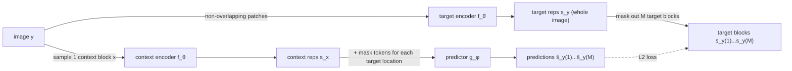
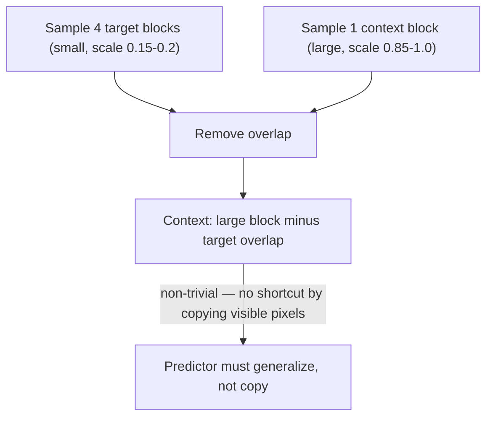

## One image, one context block, four targets

Here's the entire pretraining task in one sentence: show the model a sparse
piece of an image, and ask it to guess what the *representations* of a few other,
unseen pieces look like.

Concretely, three networks, all Vision Transformers:

**Targets first.** Run the *whole* image through the target encoder, getting a
representation per patch. *Then* mask — sample M=4 blocks (scale 0.15–0.2, aspect
ratio 0.75–1.5) from those output representations. Masking the output, not the
input, matters:

> "Note that the target blocks are obtained by masking the output of the
> target-encoder, not the input. This distinction is crucial to ensure target
> representations of a high semantic level." — *Section 3*

If you masked the input instead, the target encoder would only ever see
partial images — exactly the failure mode I-JEPA is trying to avoid for its
context encoder. Masking after encoding gives the target encoder the benefit of
full image context.

**Context next.** Sample one block (scale 0.85–1.0, almost the whole image), then
strip out any region that overlaps a target block — otherwise the model could
"predict" a target by literally copying visible pixels. What's left is "an
informative (spatially distributed) context block" — large, but full of holes
where the targets used to be.

**Predict.** The context encoder only ever sees the visible context patches (it
never processes the masked-out region — that's the compute saving). The
predictor takes the context encoder's output plus one mask token per
patch-to-predict (a shared learnable vector + a positional embedding telling it
*where* that patch sits) and outputs a representation for that location. Run it
M times, once per target block.

**Loss.** Plain average L2 distance between predicted and target patch
representations — no contrastive negatives, no temperature, no clustering.

**Avoiding collapse, the EMA trick.** The predictor `φ` and context encoder `θ`
train by ordinary backprop. The target encoder `θ̄` never does — its weights are
an exponential moving average of the context encoder's weights, updated every
step. This asymmetry is the same anti-collapse mechanism used by BYOL and DINO:
a target that drifts slowly and never receives gradient can't collapse to a
trivial constant the way a fully end-to-end target could.

> **Wait — why is the predictor a "narrow" ViT, not full-sized?** The paper sizes
> the predictor smaller deliberately: most of the representational heavy lifting
> already happened in the context encoder. The predictor's only job is to fill in
> *where* information goes, conditioned on position — a much narrower task than
> encoding the image, so a narrow network suffices.
