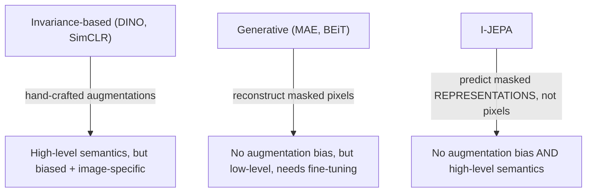

## Why not just crop and color-jitter the image twice?

That's what most self-supervised vision models do. Take an image, make two
augmented views of it (crop, flip, recolor), and train an encoder to produce the
*same* embedding for both. It works — DINO, iBOT, SimCLR all do strong work this
way. So what's wrong with it?

> "It is unclear how to generalize these biases for tasks requiring different
> levels of abstraction. For example, image classification and instance
> segmentation do not require the same invariances." — *Section 1*

Color-jitter invariance helps classify a photo as "dog" regardless of lighting.
But it can actively hurt a task like depth estimation, where color and shading
*are* the signal, not noise to be invariant to. The augmentations are also
hand-designed for images specifically — they don't generalize to audio, text, or
other modalities. You're encoding human assumptions about what should and
shouldn't matter, and those assumptions don't transfer.

The other family — generative methods like Masked Autoencoders (MAE) — sidesteps
hand-crafted augmentations entirely. Mask out patches of the image, and train the
network to reconstruct the missing pixels. No augmentation bias. But:

> "...the resulting representations are typically of a lower semantic level and
> underperform invariance-based pretraining in off-the-shelf evaluations (e.g.,
> linear-probing)." — *Section 1*

Reconstructing pixels forces the model to spend its capacity on low-level detail —
exact textures, exact colors — most of which a downstream classifier doesn't
care about. You get representations that need heavy fine-tuning to become useful.

**The question I-JEPA asks:** can you get the augmentation-free generality of
masked prediction *and* the semantic richness of invariance-based methods,
without picking up either one's weaknesses?

> **Wait — isn't predicting masked patches the same idea as MAE?** Almost — except
> *where* the prediction happens. MAE predicts in pixel space: the loss compares
> reconstructed pixels to real pixels. I-JEPA predicts in representation space:
> the loss compares predicted *embeddings* to a target encoder's embeddings. That
> one change is the entire paper.

The payoff isn't just representation quality — it's compute. I-JEPA pretrains a
ViT-Huge/14 on ImageNet in under 1,200 GPU hours: over 10× more efficient than
MAE at the same scale, and more efficient than even a *much smaller* iBOT model.
Predicting in representation space, it turns out, also makes training converge
faster.
