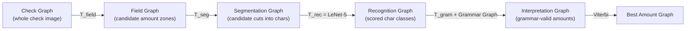

## A check reader that has to make money

Picture the actual business constraint a bank gives you: verifying the dollar amount on a check by hand is slow and expensive, but a wrong automatic answer is worse than a slow human. So the bank doesn't ask for 99% accuracy on every check — it sets an economic bar:

> "The threshold of economic viability for automatic check readers, as set by the bank, is when 50% of the checks are read with less than 1% error. The other 50% of the checks being rejected and sent to human operators." — *Section X*

The paper calls this **50% correct / 49% reject / 1% error** — and the system in Section X was one of the first to cross that bar on a real mixture of business and personal checks. Notice what this changes: the system isn't just a classifier, it's a classifier that also has to know *when it doesn't know*.

Checks actually carry the amount twice — the **Courtesy amount** (numerals, e.g. "$3.45") and the **Legal amount** (words, "three dollars and 45/xx"). The system described here reads the Courtesy amount only, for speed. That's already two sub-problems: *find* the right field among check-number, date, and "not to exceed" amounts that look just like it, then *read* it.

### One cascade of Graph Transformers, not five disconnected programs

Here's the part that makes this a GTN paper and not just an OCR paper: every stage — field-finding, segmentation, character recognition, grammar-checking, final decision — is a **graph transformer**, and every one of them is differentiable. That means the whole pipeline can be tuned end to end by gradient descent, not hand-tuned stage by stage.

Walk it left to right, *Section X-A*, *Figure 33*:

- **Field location (`T_field`)** does classical image analysis — connected components, ink density, layout — to heuristically guess rectangular zones that might hold the amount. Each guess becomes one arc, carrying a *penalty* (close to 0 if it looks like a real amount field, large if it doesn't). Because that penalty comes from a differentiable function, even this "hand-crafted heuristics" stage has tunable parameters.
- **Segmentation (`T_seg`)** cuts each candidate zone into pieces of ink using a heuristic called "hit and deflect" — cast a line down from the top of the field; when it hits ink, deflect along the object's contour instead of crossing it. The output graph represents *all* possible groupings of those ink pieces into characters, each arc penalized by how plausible the cut looks.
- **Recognition (`T_rec`)** is where LeNet-5 — the same Convolutional Neural Network from Section II — runs on every candidate segment, scoring it against 95 classes (full printable ASCII) plus a rubbish class for junk segments. "The recognizer's weights constitute the largest and most important subset of tunable parameters" in the whole system.
- **Composition with the grammar (`T_gram`)** throws out every path through the recognition graph that isn't a well-formed check amount — this step is the **generalized transduction** operation from Section VIII, combining the recognition graph with a grammar graph that encodes valid amount syntax.
- **Viterbi** picks the single lowest-penalty path left: the system's answer.

> **Wait — why not just segment once, then recognize, then check grammar in three separate hand-wired steps?** Because committing to one segmentation early throws away information the later stages need. By keeping *all* candidate segmentations and characters alive as paths in a graph, and only collapsing to a single answer at the very end, errors at any one stage can be corrected by evidence from a later one — and crucially, the parameters of *every* stage can be adjusted to reduce the system's overall mistake rate, not just each stage's local mistake rate.

### Knowing when to say "I don't know"

Crossing 50%/49%/1% means the system must produce a trustworthy **confidence** score, not just an answer. Raw Viterbi penalties from two different checks aren't comparable — they're not normalized into anything like a probability. *Figure 34* fixes this by reusing the discriminative forward loss from *Section VI*: take the chosen Viterbi answer as the "desired" target, compute the same forward score you'd use for training, and convert it:

> confidence = exp(−Edforw)

Checks below a confidence threshold get rejected to a human instead of risking a wrong answer.

### What this bought, measured

On 646 machine-printed business checks, this system scored **82% correct / 1% error / 17% reject** — versus the *previous* (non-GTN, non-globally-trained) system's **68% correct / 1% error / 31% reject** on the same test set. Same error budget, far fewer rejects. The paper attributes the gain to three things: a bigger, better-trained recognizer; the GTN architecture exploiting the grammar far more efficiently than the old hand-wired pipeline; and — the one that "is more important than it seems" — the GTN framework's flexibility for testing heuristics and tuning parameters fast, because it cleanly separates the algorithmic part of the system from the knowledge-based part.

This isn't a lab result. It was independently tested by systems integrators in 1995, beat other commercial Courtesy-amount readers, and was integrated into NCR's check-reading line. *Section X* closes with the fact that matters most for an engineer: "It has been fielded in several banks across the US since June 1996, and has been reading millions of checks per day since then."
