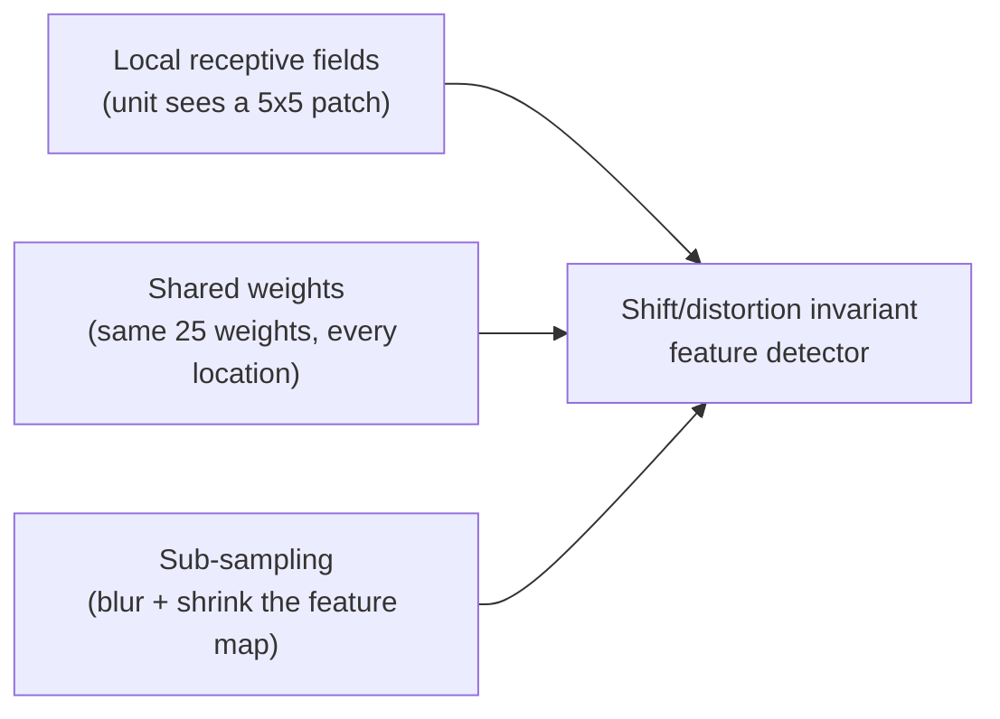
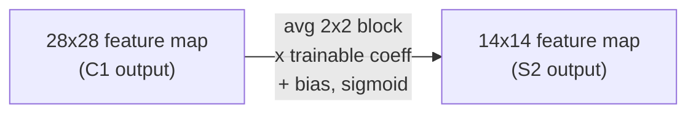

## Why a fully-connected net loses to a convolutional one

Feed a 32×32 image into a plain fully-connected layer and the network treats every pixel as an independent variable in arbitrary order. Shuffle the pixels consistently and — as far as training is concerned — nothing changes. That's the tell that something is wrong: images have "a strong 2D local structure: pixels that are spatially or temporally nearby are highly correlated" (Section II), and a fully-connected net throws that structure away before it even starts learning.

> **Wait — can't the net just learn to ignore irrelevant pixel order on its own?** In principle, with infinite data. In practice, "fully connected architectures... requires a very large number of training instances to cover the space of possible variations" (Section II) — the network has to *re-discover* locality and shift-invariance from scratch, separately for every position a feature could appear in. Convolutional nets bake that prior in instead of paying to learn it.

LeNet-5 (the network this module is built around) fixes this with three architectural ideas working together:

**Local receptive fields.** Each unit in a feature map connects to only a small neighborhood of the previous layer — not the whole thing. This forces the network to extract *elementary* visual features first (oriented edges, corners, end-points), the same things Hubel and Wiesel found cat visual-cortex neurons respond to.

**Shared weights.** Here's the key trick. All units *within one feature map* use the identical 25 weights + 1 bias, just centered at different locations. "If the input image is shifted, the feature map output will be shifted by the same amount, but will be left unchanged otherwise" — that single property is the entire basis of the network's robustness to shifts. It also slashes the parameter count: LeNet-5's first hidden layer has 122,304 *connections* but only 156 *trainable parameters*, because every one of those connections in a feature map reuses the same 25+1 numbers.

A unit computing "the same operation at different image locations, scanning across the image" is mathematically a convolution — followed by a bias and a squashing function. That's where the name comes from.

**Sub-sampling.** Once a feature is detected, its *exact* pixel location stops mattering — only its position *relative to other features* does. A subsampling layer averages each non-overlapping 2×2 block, multiplies by one trainable coefficient, adds a trainable bias, and squashes it — halving the resolution and *reducing* sensitivity to exactly the small shifts and distortions that would otherwise confuse the network.

Stacking convolution → subsample → convolution → subsample builds a "bi-pyramid": at each layer, spatial resolution shrinks while the number of feature maps (richness of representation) grows. That trade — less position precision, more feature variety — is exactly what buys geometric invariance without an explosion of free parameters.

> **Quiz check:** if weight sharing didn't exist, what would each of the 28×28 = 784 units in one C1 feature map need to learn separately, instead of sharing 26 numbers? (Hint: 25 weights + 1 bias, learned 784 times over.)
