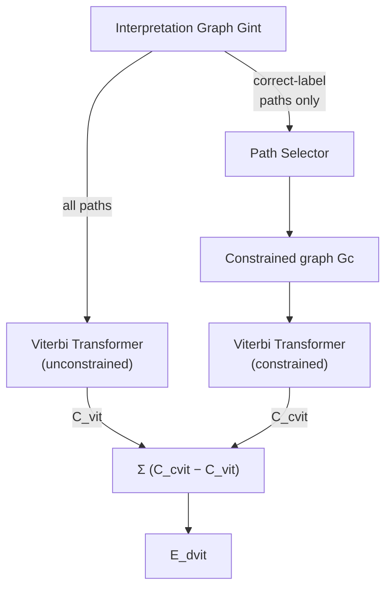

## A recognizer that gets zero training loss... by refusing to look at the input

Here's a training criterion that looks airtight: minimize the penalty of the *correct* lowest-penalty path through `Gint` (Section VI-A, "Viterbi training"). Backpropagate through the path selector and the Viterbi transformer — both are just collections of `min` and `+`, so gradients flow through them cleanly — and push that one path's penalty down.

It has a fatal flaw. If the recognizer is a plain neural net with sigmoid outputs, the *global* minimum of this loss isn't "always output the right answer." It's: **ignore the input, output the same small constant vector for every class, every time.** Every penalty collapses to the same low number, the "correct" path's penalty is trivially low, and the loss hits zero having learned nothing. The paper calls this the **collapse problem** — and it's only avoided by accident, e.g. if the output layer is fixed-parameter RBF units that physically can't all hit their minimum simultaneously at once.

> **Wait — why didn't pushing the right answer down also push wrong answers up?** Because nothing in the loss *mentions* the wrong answers. `E_vit` only ever looks at the constrained graph `Gc` (paths consistent with the correct label). The unconstrained graph — where the competing, possibly-wrong paths live — never enters the gradient. Fix that, and the collapse problem disappears.

That fix is **discriminative Viterbi training** (Section VI-B): train on the *gap*

```
E_dvit = C_cvit − C_vit
```

— the penalty of the best *correct* path minus the penalty of the best path *overall* (correct or not). `E_dvit` is always ≥ 0, and it's exactly 0 only when the best path happens to already be correct. Backprop now sends **+1** to arcs that should have had a lower penalty (they're in `Gc` but didn't win) and **−1** to arcs that wrongly *did* win but shouldn't have (Fig. 20) — the network is explicitly told to push the right answer down *and* the best wrong answer up. This is "error-correcting learning," not a probabilistic estimation procedure — no normalized likelihoods required, which matters because plugging a neural net into the graph breaks the likelihood normalization that classic HMM training (Baum-Welch) depends on.



Discriminative Viterbi still has a gap: it only compares the *single* best correct path against the *single* best overall path. It ignores every other plausible segmentation that also spells out the right answer — and it builds no margin, so the gradient vanishes the instant the two penalties tie, even if a dozen near-miss paths are lurking just behind. **Forward training** (Section VI-C) fixes the first issue by replacing the Viterbi `min` with the softer **logadd** (`f_n = logadd_i(c_i + f_{s_i})`, Eq. 13) — the *forward penalty* it computes folds in every path consistent with a label, not just the cheapest one, the same way the Baum-Welch forward pass does for HMMs. **Discriminative forward training** (Section VI-D) then takes the same correct-minus-overall gap as before, but with forward penalties instead of Viterbi penalties: `E_dforw = C_cforw − C_forw`. Because logadd is smooth everywhere (not a hard `min`), gradients now spread across *every* arc in proportion to how much that arc's path contributes to the total — concentrating training exactly on the segmentations and pixels that are causing errors, which the paper calls a clean solution to the credit-assignment problem for graph-structured outputs.
