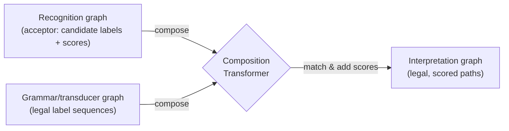

You already know the GTN idea from the previous module: instead of passing fixed-size vectors between modules, you pass **graphs** — and the whole pipeline stays differentiable. But how does one graph actually turn into another? Section VIII answers that with a single operation: **composition**.

## Standard transduction: the finite-state-transducer view

Picture two tokens, one sitting on the start node of an **acceptor graph** (your recognizer's output — symbols + scores) and one on the start node of a **transducer graph** (e.g. a grammar — legal symbol sequences, possibly weighted). The tokens crawl forward together:

> "A token can follow an arc labeled with a non-null input symbol if the other token also follows an arc labeled with the same input symbol... We have an acceptable trajectory when both tokens reach the end nodes of their graphs." — Section VIII-B

Every acceptable trajectory yields one path in a new **output graph**, whose arc weights are just the sum of the matching arcs' weights from both inputs. That's the whole operation — composition takes two graphs in, produces one graph out.

You've already seen this trick without the name: the path selector from the heuristic over-segmentation module is exactly this — a transducer graph containing only the correct label sequence, composed with the interpretation graph to yield the constrained graph.

## Generalized transduction: when arcs aren't symbols

Standard transduction assumes each arc carries a finite, enumerable symbol. But in this paper's systems, arcs carry **images, vectors, or other high-dimensional objects** that can't be enumerated. So Section VIII-C generalizes the operation. A **Composition Transformer** is any object implementing three methods:

| Method | Job |
|---|---|
| `check(arc1, arc2)` | Look at the data on two arcs (one per input graph) — should an arc/subgraph be created in the output? |
| `fprop(...)` | If `check` says yes, build the new arc(s)/node(s) and compute their attached values from `arc1`, `arc2`. |
| `bprop(...)` | During training, push gradients from the output arcs back into `arc1`, `arc2`, and any parameters `fprop` used — this requires `fprop` to be differentiable. |

> "The check method can be seen as constructing a dynamic architecture of functional dependencies, while the fprop method performs a forward propagation through that architecture... The bprop method performs a backward propagation through the same architecture." — Section VIII-C

`check` decides the *structure* of an on-the-fly computation graph; `fprop`/`bprop` are just forward/backward passes through it — the same forward/backward discipline you saw for ordinary neural network layers, now operating on graphs instead of tensors.

> **Wait — isn't this just regular function composition?** No: in a normal pipeline, the function's *shape* (which inputs feed which outputs) is fixed at design time. Here, `check` decides the shape *per input*, dynamically, based on what's actually in the data — the architecture itself is data-dependent, and the differentiable parts (`fprop`/`bprop`) ride along on top of whatever shape `check` produced.

Standard transduction is just a special case: `check` tests symbol equality, `fprop` creates one arc carrying the transducer's output symbol. And in practice, the output graph is never fully built — only the nodes a search algorithm like Viterbi or Beam Search actually visits get instantiated, so pruning benefits propagate through the whole GTN automatically.

This is why GTNs generalize past "fixed-size vector pipelines": the composition step doesn't care if what's on an arc is a discrete symbol or a 32×32 image — as long as `check`/`fprop`/`bprop` are defined, the same global-training machinery from the discriminative-training module applies unchanged.

— Section VIII, *Graph Transformer Networks and Transducers*
