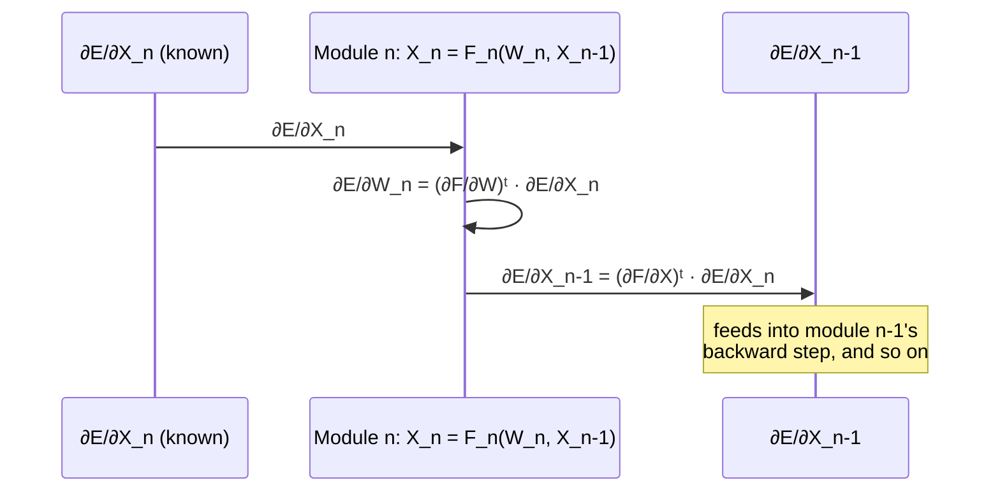

## What does it even mean for a machine to "learn"?

Strip away the neural-network flavor text and a learning machine is just a function with knobs:

> "The learning machine computes a function Y_p = F(Z_p, W) where Z_p is the p-th input pattern, and W represents the collection of adjustable parameters in the system." — Section I-A

A **loss function** E_p = D(D_p, F(W, Z_p)) scores how wrong the output is for one example, and the **average loss** E_train(W) is that error averaged over the whole training set. Learning = find the W that minimizes E_train(W).

### The trap: minimizing training error isn't the goal

Here's the question every beginner gets wrong: if E_train(W) is what you minimize, why not just make the model big enough to drive it to zero?

> "In practice, the performance of the system on a training set is of little interest. The more relevant measure is the error rate of the system in the field." — Section I-A

The paper gives the relationship between train and test error directly:

**E_test − E_train ≈ k·(h/P)^α**

where *P* is the number of training samples, *h* is the model's "effective capacity," and α is between 0.5 and 1.0. Read the variables and the trade-off falls out:

- More capacity *h* → lower E_train, but a **bigger gap** to E_test.
- More data *P* → the gap shrinks, for any fixed capacity.

So there's an optimal capacity for a given dataset size — too little and you underfit, too much and the gap swamps you. (This is *Structural Risk Minimization*: minimize E_train + λ·H(W), where the regularization term H(W) penalizes high-capacity parameter settings directly.)

### Gradient descent: the mechanism that does the minimizing

Because E(W) is smooth and differentiable almost everywhere, you don't need to search the parameter space blindly — you follow the slope:

**W_k = W_{k−1} − η · ∂E(W)/∂W**

The stochastic variant updates W from a *single* example's gradient at a time, "fluctuates around an average trajectory," but converges faster than full-batch descent on large, redundant datasets like speech or character data — which is most of why it won, practically, over second-order methods.

### Backpropagation: gradients through layers

Gradient descent only works if you can get ∂E/∂W cheaply. Backpropagation — popularized by Rumelhart, Hinton and Williams — computes it "by propagation from the output to the input." The paper gives the general recurrence for a cascade of modules, where module *n* computes X_n = F_n(W_n, X_{n−1}):

Each module needs only the gradient handed to it from the layer downstream, plus its own two Jacobians (with respect to its weights, and with respect to its input) — it never needs to know anything about the rest of the network. That locality is *why* backprop scales to arbitrarily deep cascades.

> **Wait — why didn't this work earlier if the math is simple?** The paper points to three separate realizations that had to land together: local minima turned out not to be a practical obstacle for these networks (despite theoretical fears), backprop gave an efficient way to compute the gradient through layers, and multi-layer sigmoid networks trained this way could solve genuinely hard tasks. Any one alone wasn't enough.

### The generalization that sets up everything else in this paper

Ordinary neural nets are the special case where the "state" X_n passed between modules is a **fixed-size vector**. Section I-E points out you don't need that:

> "The state information in complex recognition systems is best represented by graphs with numerical information attached to the arcs. In this case, each module... takes one or more graphs as input, and produces a graph as output. Networks of such modules are called Graph Transformer Networks (GTN)."

Same backward recurrence, same gradient-based training — just with graphs flowing between modules instead of vectors. Keep that picture in mind; it's the bridge from "train one classifier" to "train an entire multi-module document-recognition system end to end," which is where this paper is ultimately headed.
