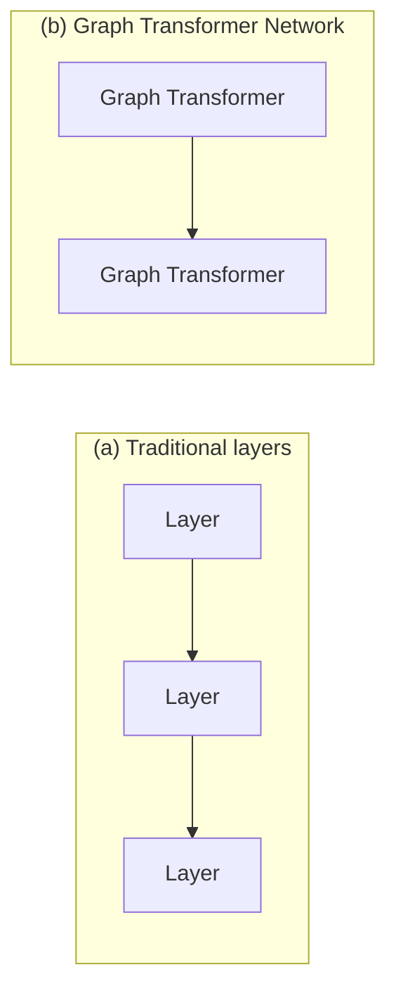

## What if a module's "vector" is a word that hasn't been segmented yet?

A continuous speech signal, or a handwritten word, doesn't come pre-chopped into a fixed number of pieces. Bolt a fixed-size-vector module onto that and you've already lost — you needed to decide segmentation *before* the module that's supposed to help you decide it.

> "The limited flexibility of fixed-size vectors for data representation is a serious deficiency for many applications, notably for tasks that deal with variable length inputs... or for tasks that require encoding relationships between objects or features whose number and nature can vary." — Section IV-C

The paper's fix: let the "state" passed between modules be a **directed graph**, where each arc carries a vector (or just a scalar penalty), instead of a single fixed-size vector.

*(Fig. 15.)* Traditional layers pass fixed-size vectors. Graph Transformers pass **graphs whose arcs carry numerical information** — and a network of them is a **Graph Transformer Network (GTN)**.

### Why a graph, specifically?

Each path through the graph represents one alternative interpretation of the input. A speech system, for example, might start with one sequence of acoustic vectors, transform it into a lattice of phonemes (a distribution over phoneme sequences), then a lattice of words, then finally collapse to one best word sequence — each stage a graph transformer refining the graph it received.

> **Wait — isn't a graph just a fancy probability distribution?** Sometimes, but not necessarily. "All the quantities manipulated are viewed as penalties, or costs, which if necessary can be transformed into probabilities by taking exponentials and normalizing." The paper deliberately stays agnostic about probability theory — penalties are enough, and you only commit to a probabilistic reading if you need one.

### Backprop, unchanged in spirit, generalized in scope

> "Gradient back-propagation through a Graph Transformer takes gradients with respect to the numerical information in the output graph, and computes gradients with respect to the numerical information attached to the input graphs, and with respect to the module's internal parameters." — Section IV-C

That's the exact same fprop/bprop discipline from the previous lesson — nothing new is invented. The only change is what flows between modules: graphs instead of vectors. As long as the function producing the output graph's numbers from the input graph's numbers (plus parameters) is differentiable, gradient-based learning still applies, end to end, across the whole pipeline.

The next several sections build up exactly this: a GTN for recognizing strings of characters without ever being handed the correct segmentation as ground truth.
