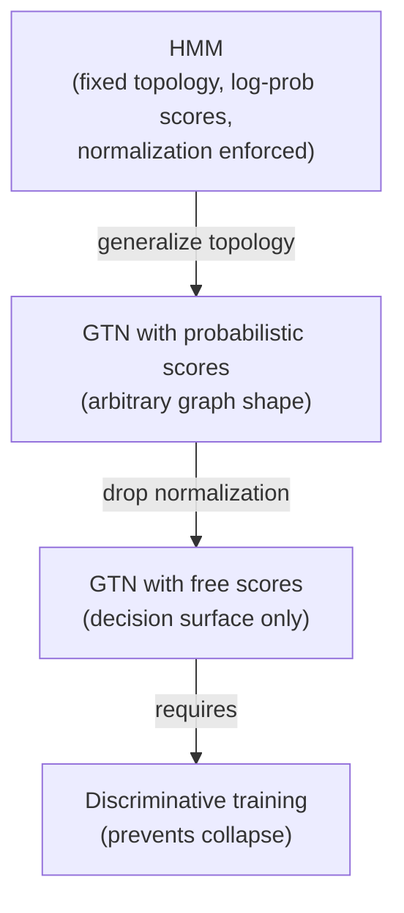

If you've worked with speech recognition, you already know Hidden Markov Models: states, transitions, emission probabilities, all stitched together with the Viterbi algorithm. So why did this paper invent a whole new formalism instead of just using HMMs? Section VIII-E answers directly:

> "GTNs can be seen as a generalization and an extension of HMMs." — Section VIII-E

## HMMs are a GTN with extra constraints

Unfold an HMM in time and you get a graph with a node `n(t, i)` for each time step `t` and state `i` — which is exactly what this paper has been calling an **interpretation graph**. The arc penalty `c` from `n(t-1, j)` to `n(t, i)` is the negative log-probability of emitting the observed data at time `t` while transitioning `j → i`. Sum the penalties along the best path, and you've got the negative log-likelihood Viterbi already computes. An HMM is a GTN whose graph topology happens to look like a time-unrolled state machine, with scores that happen to be constrained to be log-probabilities.

## What GTNs drop, and what they add

A classical HMM's parameters **must** stay valid probabilities — every emission and transition distribution has to sum to 1. That constraint is a double-edged sword:

> "With classical HMMs with fixed preprocessing, [the collapse] problem does not occur because the parameters of the emission and transition probability models are forced to satisfy certain probabilistic constraints... Therefore, when the probability of certain events is increased, the probability of other events must automatically be decreased." — Section VIII-E

GTNs let you keep that probabilistic interpretation, push it to the final decision stage only, or **drop it entirely** — penalties become arbitrary scores, and the network just represents a decision surface. That flexibility is exactly what made the discriminative-training module's collapse failure mode possible in the first place: without the probabilistic normalization constraint, a non-discriminative loss can let the network cheat by shrinking every score together. The fix from that module — train discriminatively — is the price GTNs pay for dropping the HMM's built-in safety rail.

The other direction GTNs extend HMMs: **composability**. Pereira et al.'s transducer framework already stacks HMMs representing different processing levels in speech recognition (Section VIII-E) — GTNs formalize that stacking as graph composition (the previous lesson), with `bprop` carrying gradients across every level at once, instead of training each HMM stage separately.

## Applying it: would you reframe an HMM pipeline as a GTN?

Scenario: you have a speech-recognition system built from several independently-trained HMM stages (acoustic model → pronunciation model → language model), and accuracy has plateaued. Framing the whole pipeline as a GTN buys you:

- **End-to-end discriminative training** — gradients flow from the final word-error objective back through every stage, instead of each HMM being trained to maximize its own local likelihood.
- **No forced re-derivation of the probabilistic math** — you can keep log-probability scores if you want them, or relax to free scores where the probabilistic assumptions don't fit your data.
- **The same composition operation already covers it** — stacking HMM-like stages is literally what Pereira et al.'s transducer composition already does; a GTN reformation doesn't need a new algorithm, just the generalized `check`/`fprop`/`bprop` from the previous lesson.

What it does **not** buy you for free: you still need a discriminative loss (Section VI) to avoid the collapse effect once you drop or relax the probabilistic constraints — generalizing the topology without changing the training objective just reproduces the HMM's results with extra machinery.
