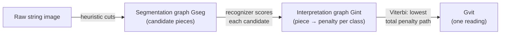

## How do you read "342" without anyone telling you where the digits start and end?

A single isolated digit is easy — crop the image, feed it to a recognizer, done. But a check reads "**$1,342.00**", scrawled as one continuous stroke. Where does the "3" end and the "4" begin? You can't recognize a character you haven't cut out yet, but you can't cut it out correctly until you already know what it is.

LeCun et al. break the deadlock with **Heuristic Over-Segmentation** (Section V): instead of committing to one segmentation, generate *all the plausible ones* and let the recognizer itself pick the best path through them.

1. A segmentation heuristic chops the string into candidate pieces — single characters, but also candidate *fusions* of touching characters and candidate *splits* of one character into two strokes.
2. Every candidate piece becomes one arc in a **segmentation graph** `Gseg`: a directed path of nodes where each arc carries one candidate image.
3. A **recognition transformer** expands each `Gseg` arc into a small bundle of arcs — one per possible class label — each carrying the recognizer's penalty for "this candidate image is a 3", "...is an 8", and so on. The result is the **interpretation graph** `Gint`.

> **Wait — isn't this just running the recognizer once per character?** No. Because the segmentation itself is ambiguous, `Gint` contains *every consistent way to read the whole string* simultaneously — overlapping candidate cuts and all. A single path from start to end through `Gint` is one full reading of the string: a specific segmentation *and* a specific label for each resulting piece.

Each arc's penalty is just a number — low means "the recognizer is confident this is a real character of this class," high means "unlikely" (a badly-cut fragment, two characters fused, noise). The **penalty of one full interpretation** is the sum of the penalties along its path through `Gint` (Section VI-A). To actually read the string, the **Viterbi algorithm** — the classic shortest-path-by-dynamic-programming trick — finds the single path through `Gint` with the lowest cumulative penalty in one efficient pass (Eq. 10), without ever enumerating every path explicitly.

The key trick the paper makes explicit: *the supervisor never has to say which segmentation is correct.* All a label-giver provides is the desired character sequence ("342"); the system itself, via the graph, discovers which combination of cuts produces that sequence at lowest cost. That's the seed that the next lesson grows into a full training procedure.
