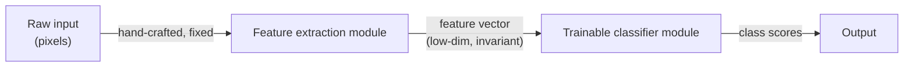

## A 1998 paper that's still the right way to think about pattern recognition

Picture a 1990s OCR engineer staring at a pile of scanned checks. Someone has to decide: *which* pixels matter? Slant angle? Stroke width? Loop closure on the "8"? Whatever they pick becomes a hand-tuned **feature extractor**, and the moment the task changes — checks today, zip codes tomorrow — they redo it from scratch.

LeCun, Bottou, Bengio and Haffner open by naming this bottleneck directly:

> "The recognition accuracy is largely determined by the ability of the designer to come up with an appropriate set of features. This turns out to be a daunting task which, unfortunately, must be redone for each new problem." — Section I

That's the whole argument of the paper in one sentence: **stop hand-designing features, learn them.**

### The traditional pipeline — and where it breaks

Classic pattern recognition splits the work into two modules:

*(Fig. 1 in the paper.)* Only the **classifier** half is trainable. The feature extractor is fixed by hand, "contains most of the prior knowledge," and is "the focus of most of the design effort, because it is often entirely hand-crafted."

> **Wait — isn't hand-crafting features just normal engineering?** It was the only option for a while: early classifiers "were limited to low-dimensional spaces with easily separable classes," so someone had to compress raw pixels down by hand first. The paper's claim is that three things changed by the late 1990s — cheap fast machines, large labeled datasets, and learning techniques that handle high-dimensional input directly — so that constraint no longer holds. You can now let *both* halves learn.

### Why this matters for everything that follows

The paper's two case studies map directly onto this idea:

- **Character recognition** (Sections I–III): replace the hand-crafted feature extractor with "carefully designed learning machines that operate directly on pixel images" — this is the Convolutional Neural Network, covered next.
- **Document understanding** (Sections IV+): replace a hand-integrated *pipeline of modules* (field locator → segmenter → recognizer → language model) with one **unified, well-principled design paradigm** — Graph Transformer Networks — that trains every module jointly against a single global objective.

Same complaint, two scales: don't hand-design the features, and don't hand-tune how modules talk to each other. Both get replaced by gradient-based learning — which is exactly the formalism in the next lesson.
