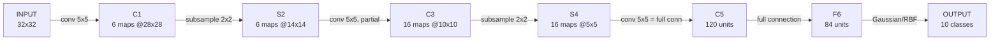

## Seven layers, one digit out

LeNet-5 takes a 32×32 pixel image and ends with 10 numbers — one penalty score per digit class. Why 32×32 when MNIST digits are size-normalized into a 20×20 box? Because the *highest-level* feature detectors (layer C3) need room for a distinctive feature — a stroke end-point, a corner — to land in the center of their receptive field, "even if it's near the edge of the digit." The paper sizes the input so C3's receptive-field centers exactly cover a 20×20 area in the middle of the 32×32 field.

| Layer | Type | Shape | Trainable params | Connections |
|---|---|---|---|---|
| C1 | conv, 5×5 | 6 @ 28×28 | 156 | 122,304 |
| S2 | subsample, 2×2 | 6 @ 14×14 | 12 | 5,880 |
| C3 | conv, 5×5, **partial** | 16 @ 10×10 | 1,516 | 151,600 |
| S4 | subsample, 2×2 | 16 @ 5×5 | 32 | 2,000 |
| C5 | conv, 5×5 (≈full) | 120 | 48,120 | 48,120 |
| F6 | fully connected | 84 | 10,164 | 10,164 |
| OUTPUT | Euclidean RBF | 10 | — | — |

Total: 340,908 connections, but only **60,000** trainable parameters — weight sharing again, at network scale.

### Why C3 isn't fully connected to S2

Every other layer connects "all of the previous layer's maps to every unit" in some form, but C3 deliberately *doesn't* connect every one of S2's 6 feature maps to every one of C3's 16 feature maps (see Table I in the paper). Two reasons:

1. **Keep connections within reasonable bounds.** Full connectivity here would balloon the parameter count.
2. **Force a break of symmetry.** "Different feature maps are forced to extract different (hopefully complementary) features because they get different sets of inputs." Full connectivity lets every C3 map see everything and risks them all converging on the same redundant feature.

> **Wait — isn't C5 just a fully-connected layer wearing a conv label?** Functionally at this input size, yes — S4 is already 5×5 and C5's kernel is 5×5, so each C5 unit's receptive field *is* all of S4, making the output 1×1. But the paper labels it `C5` (convolutional) on purpose: "if LeNet-5 input were made bigger with everything else kept constant, the feature map dimension would be larger than 1×1." The conv framing is what lets the same architecture scale to bigger inputs without redesigning the layer — exactly the trick reused later for Space-Displacement Neural Networks (Section VII).

### The output layer: RBF units, not softmax

F6's 84 sigmoid units feed into 10 Euclidean Radial-Basis-Function units — one per class — each computing the squared distance between F6's state and a fixed, hand-chosen 84-bit "stylized image" code for that class (drawn on a 7×12 bitmap, hence 84). Smaller output = better fit. The codes for visually confusable characters (uppercase O, lowercase o, zero) are deliberately made *similar*, so a downstream language-model post-processor has a chance to disambiguate them later — a design choice that only makes sense once you remember this network is one module in a larger document-recognition pipeline (the subject of the next module).
