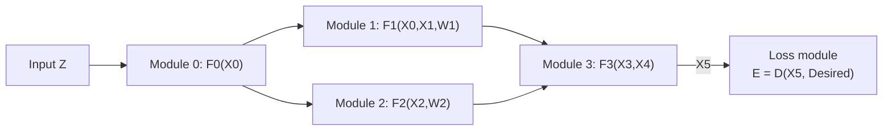

## Backprop doesn't care that it's a "neural network"

Everything so far trained one kind of system: layers of matrix-multiplies and sigmoids, stacked uniformly. But look again at what backprop actually needs:

> "In principle, derivatives can be back-propagated through any arrangement of functional modules, as long as we can compute the product of the Jacobians of those modules by any vector." — Section IV

Nothing in that sentence says "neural network." It says: any module, as long as it has a Jacobian. That's the door this section walks through.

### Why bother with multiple heterogeneous modules?

> "Large and complex trainable systems need to be built out of simple, specialized modules." — Section IV

LeNet-5 is already an example — it mixes convolutional layers, sub-sampling layers, fully-connected layers, and RBF layers in one trainable cascade (Fig. 14). The next two sections go further: a system that segments *and* recognizes words simultaneously, without ever being told the correct segmentation.

*(Fig. 14.)* A multi-module system is defined by two things: what each module computes, and the **graph** of how modules connect. That graph fixes a partial order for the forward pass — module 0 first, then 1 and 2 (possibly in parallel), then 3. Crucially, the paper makes no distinction between trainable weights (W1, W2), external inputs/outputs (Z, D, E), and intermediate states (X1...X5) — they're all just slots in the same computation graph.

### fprop / bprop: the pattern that makes this composable

Each module class implements two methods:

| Method | Direction | Job |
|---|---|---|
| `fprop` | forward | compute this module's output from its inputs |
| `bprop` | backward | take the gradient w.r.t. this module's output, produce the gradient w.r.t. its inputs and its own parameters |

> "All the derivatives in the system can be computed by calling the bprop method on all the modules in reverse order compared to the forward propagation phase." — Section IV-A

Complex modules are built by nesting simpler ones — a module's `fprop` can just call its members' `fprop` methods in sequence. There's a neat duality here: a sum in the forward direction becomes a fan-out (replication) backward, and a fan-out forward becomes a sum backward.

> **Wait — does every module have to be differentiable everywhere?** No. A *multiplexer* module (switches between two inputs based on a discrete control signal) isn't differentiable w.r.t. the switching input — but it's still differentiable w.r.t. the regular inputs, and the whole system stays trainable as long as the switching signal doesn't itself depend on the parameters. Even a *min* module is differentiable everywhere except on a measure-zero boundary, which doesn't stop gradient descent from converging in practice. This matters later (Section VIII): the multiplexer is a special case of an architecture that reconfigures itself per input.

This object-oriented fprop/bprop pattern is exactly what makes the next idea possible: modules whose inputs and outputs aren't vectors at all.
