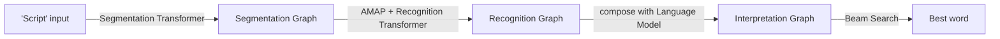

## A recognizer that has to keep up with your pen

Type into a phone and the system can wait for you to finish. Write on a pen-computer and it can't — "on-line" handwriting recognition means the machine must produce immediate feedback as the user writes, character by character, word by word. Section IX builds a complete GTN for exactly this, with a Convolutional Neural Network as its recognizer core.

### Representing a pen stroke without segmenting it

Before recognition even starts, there's a representation choice: throw away the stroke trajectory and just rasterize the final image? Or keep the order information? The paper's answer is **AMAP** — a low-resolution image where every pixel is a 5-element feature vector: four features for the four orientations of pen movement through that pixel's neighborhood, and a fifth for local curvature.

> "A particularly useful feature of the AMAP representation is that it makes very few assumptions about the nature of the input trajectory. It does not depend on stroke ordering or writing speed... AMAPs can be computed for complete words without requiring segmentation." — Section IX-A

That last point matters: just like the SDNN idea from the previous module, AMAP sidesteps segmentation rather than trying to get it right upfront.

### Two competing GTN architectures, one recognizer core

*(Fig. 30, the Heuristic Over-Segmentation variant.)* A second variant (Fig. 31) replaces the first two stages with an **SDNN Transformer** that slides the recognizer across the whole word instead of pre-cutting it — the same SDNN idea from Section VII, here composed with a left-to-right HMM per character class. Both variants share the same character-recognition core: a 5-layer CNN close to LeNet-5, but with an architecture-specific kernel/feature-map count, ending in adaptive RBF units (95 classes — full printable ASCII).

### What "global training" buys you, measured

Training happens in two phases: first bootstrap the network on isolated characters (minimizing distance to the correct-class RBF center), then retrain *every* parameter — network weights and RBF centers together — against a single word-level discriminative criterion (the Discriminative Forward loss from the earlier training module).

The headline numbers, on a database of 881 lower-case words, writer-independent:

| System | Before word-level training | After word-level training | Relative drop |
|---|---|---|---|
| Heuristic Over-Segmentation, no dictionary | 22.5% word / 8.5% char error | 17% word / 6.3% char error | ~24% word, ~26% char |
| Heuristic Over-Segmentation, 25,461-word dictionary | 4.6% word / 2.0% char error | 3.2% word / 1.4% char error | ~30% word, ~30% char |
| SDNN/HMM, no dictionary | 38% word / 12.4% char error | 26% word / 8.2% char error | ~32% word, ~34% char |

> **Wait — wasn't the network already trained on characters? What does "word-level training" add?** Character-level training only ever sees isolated, pre-segmented characters — it never learns to penalize a *plausible-looking wrong segmentation* of a whole word. Word-level discriminative training (Section VI's machinery, applied here) backpropagates a single loss through the entire segmentation → recognition → language-model pipeline, so the recognizer learns to reject bad segmentations as a side effect of minimizing word error directly — exactly the "train on the criterion you actually care about" argument from Section V.

The paper also found that normalizing the whole word at once (rather than normalizing each segmented piece separately) dropped error rates by 37% (word) and 43% (character) relative — evidence that "normalizing the word in its entirety is better than first segmenting it and then normalizing... each of the segments" (Section IX-D, carried over into Section X's check reader).
