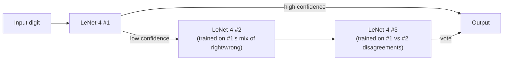

## "3x more expensive" — except it isn't

Boosted LeNet-4 trains three networks and chains them: the second net trains on a 50/50 mix of patterns the first net got right and wrong, and the third trains only on patterns where the first two disagree. At test time, all three vote. That sounds like 3x the inference cost of a single net. It isn't:

> *"When the first net produces a high confidence answer, the other nets are not called. The average computational cost is about 1.75 times that of a single net."* — Section III-C.9

The lesson generalizes past this paper: an ensemble's *worst-case* cost and its *average* cost are different numbers, and a confidence-gated cascade can buy you most of an ensemble's accuracy gain for a fraction of its naive cost.

### Capacity has to match the data you actually have

The paper traces a real historical arc: LeNet-1 (1989, ~2,600 parameters) was state of the art *because* that's what the available training data and compute could support. As datasets and machines grew, LeNet-4 and LeNet-5 (tens of thousands of parameters) became trainable — and beat LeNet-1, because more capacity could now be backed by more data without overfitting.

> *"LeNet-1 was appropriate to the available technology in 1989, just as LeNet-5 is appropriate now... As computer technology improves, larger-capacity recognizers become feasible. Larger recognizers in turn require larger training sets."* — Section III-D

This is why the training-set-size experiment (Fig. 6) matters: error keeps dropping as training examples grow from 15,000 to 60,000, even for a "specialized" architecture like LeNet-5. The architecture sets a ceiling; the data determines how close you get to it.

### The SVM result is the most philosophically interesting one

The Support Vector Machine reaches 1.1%–1.4% error using **no prior knowledge about images at all** — it would perform identically if every image's pixels were permuted by a fixed, scrambling mapping. That's remarkable: it gets close to CNN-level accuracy purely from margin maximization in a high-dimensional space. The catch is cost: a plain polynomial SVM needs ~14 million multiply-adds per digit; even the cheapest reduced-set SVM variant needs ~60% more compute than LeNet-5 for a comparable error rate. CNNs win on accuracy *per unit of compute and memory*, not on accuracy alone.

### What the paper concludes

> *"We find that boosting gives a substantial improvement in accuracy, with a relatively modest penalty in memory and computing expense."*

Memory-based methods (K-NN, Tangent Distance) need megabytes of stored templates and scale recognition time with the size of the training set; neural nets compress what they learned into a fixed, small set of weights — an advantage that "will become more striking as training databases continue to increase in size" (Section III-D).
