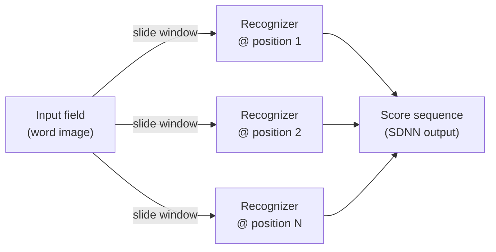
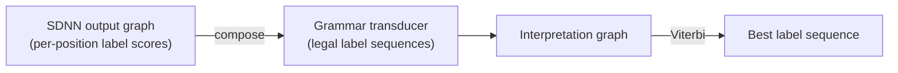

## Why segment at all?

Every word-recognition system you've seen so far in this subject has to answer an annoying question first: *where does one character end and the next begin?* Heuristic over-segmentation guesses cut points, then lets the recognizer veto the bad ones. But guessing is fragile — touching characters, disconnected ink, and wildly varying character widths all break the guesser before the recognizer ever gets a turn.

What if you never segmented at all?

> "There is a simple alternative to explicitly segmenting images of character strings using heuristics. The idea is to sweep a recognizer at all possible locations across a normalized image of the entire word or string." — Section VII

That's a **Space Displacement Neural Network (SDNN)**: take the character recognizer and slide it over every position in the input, producing a score at each one. No cut points, no guessing — "the system essentially examines all the possible segmentations of the input" (Section VII).

> **Wait — isn't "try the recognizer everywhere" insanely expensive?** For a generic classifier, yes. The paper names this as the obvious objection: *"the method is in general quite expensive. The recognizer must be applied at every possible location."* SDNN only works because the recognizer here is specifically a CNN.

## Why a CNN makes this cheap

Run a fully-connected classifier at every shifted position and you redo the entire computation at every offset — wasteful. But a convolutional network's units are local and weight-shared, so two overlapping windows compute *almost the same thing*:

> "Because of the convolutional nature of the network, units in the two instances that look at identical locations on the input have identical outputs, therefore their states do not need to be computed twice. Only a thin 'slice' of new states... needs to be recomputed." — Section VII

Slide the window over by one pixel, and only the new edge of the receptive field needs new computation — everything the two windows have in common is already done. The replicated network is, structurally, just one larger convolutional network whose feature maps got wider; "the output layer effectively becomes a convolutional layer" producing one score-vector per position, for roughly the cost of running the CNN once over the whole field.

This also explains why SDNN is attractive specifically for **cursive handwriting**, where "no reliable segmentation heuristic exists" (Section VII-A) — there's no good guesser to fall back on, so removing the need for one is the entire point.

## From a score sequence to an answer

SDNN doesn't hand you a final answer — it hands you a *sequence of vectors*, one per scanned position, each scoring "how much does this look like a digit/letter here?" Real characters tend to get spotted by several neighboring positions at once, and partial characters (e.g. a recognizer seeing only the right third of a "4") can fire spuriously for the wrong label.

Cleaning that up is exactly the kind of consistency problem a Graph Transformer Network is built for (the concept you met in the multi-module systems lesson): the SDNN output is coded as a linear graph of weighted label arcs, then **composed** with a grammar transducer that knows which label sequences are legal. The composition is the *interpretation graph* — Section VIII gives the efficient composition algorithm, so this "combinatorially intractable"-looking operation is actually cheap.

## The catch

SDNN is elegant, but the paper is candid about where it stands:

> "SDNN is an extremely promising and attractive technique for OCR, but so far it has not yielded better results than Heuristic Over-Segmentation." — Section VII-C

It puts "enormous demands on the recognizer" (VII-A) — every position has to be classified correctly, including positions dominated by a neighboring character — so its payoff depends entirely on how strong the underlying recognizer is. LeNet-5 was robust enough to show striking invariance on multi-digit strings with touching and disconnected digits, but the technique only earns its keep when the recognizer can carry that weight.
