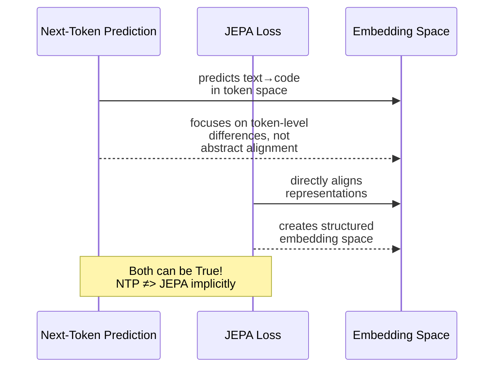

# The LLM-JEPA Objective: Combining Generative and Predictive Learning

The genius of LLM-JEPA is that it doesn't abandon next-token prediction. Instead, it *augments* it.

## The hybrid loss function

The standard LLM training loss only cares about predicting the next token:

```
L_LLM = cross-entropy(predicted_token, ground_truth_token)
```

LLM-JEPA keeps this but adds a second term:

```
L_LLM-JEPA = L_LLM + λ × d(Pred(Enc(Text)), Enc(Code))
```

Here's what each piece does:

- **L_LLM** (left side): the original next-token prediction loss. This preserves generative capabilities — the model still learns to generate tokens accurately.
- **d(Pred(Enc(Text)), Enc(Code))** (right side): the JEPA term. Instead of reconstructing tokens, you:
  1. Encode both Text and Code into embedding vectors (`Enc(Text)` and `Enc(Code)`)
  2. Train a lightweight predictor (`Pred`) to map Text's embedding to Code's embedding
  3. Minimize the distance `d` between them (using cosine similarity)
- **λ**: a hyperparameter that balances the two objectives. Higher λ means "trust the JEPA term more."

The magic insight: **you're not trading off generative ability for representation quality.** Both terms can coexist, and the next-token prediction loss doesn't implicitly minimize the JEPA loss (we'll see evidence of this later).

## Making it efficient: custom attention masks

Here's the implementation challenge: to compute embeddings for Text and Code separately, you need them to not attend to each other. But if you naively concatenate them, the Code tokens see the Text tokens and vice versa.

The solution: a **custom two-block attention mask**. Instead of a single causal mask that prevents position *i* from attending to position *j* (when *i* < *j*), you create two independent causal triangles:

```
[Text tokens: causal mask within text block]
[Code tokens: causal mask within code block]
(Text and Code never attend to each other)
```

This way, `Enc(Text)` is computed on Text-only context, and `Enc(Code)` is computed on Code-only context. They're treated as if they were processed by separate models, even though they share weights.

## The predictor: using extra tokens

The predictor `Pred` doesn't need to be a separate network. Instead, the paper appends special tokens (like `[PRED]`) to the input and uses the transformer's own self-attention to compute predictions. This reuses the model's existing weights, drastically reducing overhead.

## Why not just next-token prediction?

A natural question: if the next-token prediction loss already tries to model both Text and Code, why does adding an explicit JEPA term help?



The paper shows this empirically: training with NTP-only doesn't minimize the JEPA objective, even though both involve mapping Text to Code. The difference is subtle but crucial: NTP optimizes for *token-level* correctness; JEPA optimizes for *representation-level* alignment.
