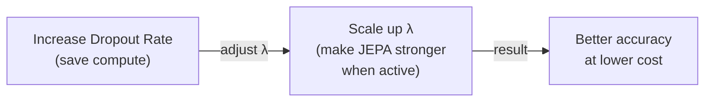

# Efficiency: Scaling JEPA to Real-World Compute

There's a catch: LLM-JEPA requires an extra forward pass to compute embeddings for both Text and Code. This doubles the training cost—a serious bottleneck for large-scale pretraining.

The paper proposes a surprisingly simple solution: **random loss dropout.**

## The loss dropout trick

During training, randomly drop the JEPA loss at a specified rate *LD* (e.g., LD=0.5 means "skip the JEPA term 50% of the time").

When you drop the JEPA term:
- You don't need to compute `Enc(Code)`
- You save one forward pass per batch
- You only need one forward pass (the usual next-token prediction one)

**Per-epoch cost:** (2 - LD) × baseline cost

If LD=0.5, the cost is 1.5× baseline. If LD=0.75, it's 1.25×.

## Results at constant compute

The paper measures accuracy against **PFLOPs** (petaflops), a compute-normalized unit. At the same total compute budget:

| FLOP Budget | Baseline (NTP) | LLM-JEPA (LD=0) | LLM-JEPA (LD=0.5) |
|-------------|---------------|-----------------|------------------|
| ~5 PFLOPs | ~20% | ~25% | ~28% |
| ~20 PFLOPs | ~40% | ~55% | ~65% |
| ~40 PFLOPs | ~60% | ~70% | ~75% |

This is remarkable: **with the same compute, loss dropout LLM-JEPA can be *significantly* better than standard training.** You're essentially getting free accuracy by spending the compute more intelligently.

## Tuning λ and dropout together

A key empirical finding: as you increase the dropout rate, you should increase λ (the JEPA weight) to compensate:

**Rule of thumb:** keep λ × (1 - LD) approximately constant.

Intuition: if you're dropping the JEPA term 50% of the time, make it twice as important when it does run. This maintains the "average gradient signal" from the JEPA loss.

## Design choice implications

The paper runs an ablation study on key design choices:

| Choice | Accuracy | Notes |
|--------|----------|-------|
| Cosine similarity (our choice) | 71.5% | ✓ Best performer |
| L2-norm | 70.6% | Close, but slightly worse |
| MSE | 2.2% | Fails completely |
| Prepend [PRED] instead | 68.1% | Worse than appending |
| Reverse direction (Code→Text) | 65.7% | Asymmetry matters |
| InfoNCE loss | 34.4% | High variance, poor performance |

The takeaway: **small design choices matter.** The specific choice of cosine similarity (standard in vision) outperforms alternatives. But the margin isn't enormous—most reasonable choices work better than baseline.

## The 2× compute cost: real but manageable

The primary limitation is honest: training *with* the full JEPA objective (LD=0) is 2× slower than baseline. For billion-parameter models, this is significant.

But with loss dropout, you can recoup most of this cost while keeping the accuracy gains. The paper suggests this opens the door to "full-scale pretraining with minimal computational overhead," though full-scale experiments remain future work.
