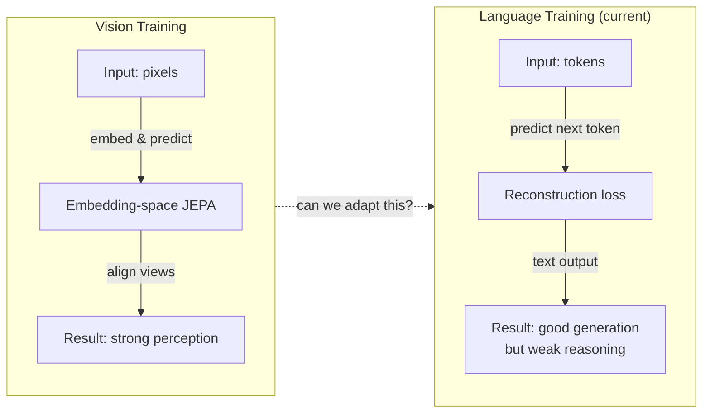

# Why Language Models Need More Than Next-Token Prediction

Large language models dominate the field by training on a simple objective: predict the next token given all previous tokens. But is this really the best way?

Vision models discovered something surprising. Researchers found that embedding-space training objectives—where you predict a learned representation instead of raw pixels—consistently outperform input-space reconstruction. These techniques, collectively called **Joint-Embedding Predictive Architectures (JEPAs)**, learn to align different "views" of the same underlying concept without reconstructing the original input.

Yet in natural language processing, reconstruction-based methods remain the norm. LLMs are trained almost exclusively to generate text, making it "challenging to leverage JEPA objectives" even though many NLP tasks "involve perception and reasoning where JEPA is known to be preferable" (Abstract).

Here's the core question: **can language training methods learn a few tricks from the vision ones?**

The problem is that LLMs are primarily evaluated on their generative capabilities—their ability to produce text. This creates a fundamental tension: vision models can afford to abandon reconstruction entirely, but language models need to keep that generative ability *while* gaining JEPA's benefits.

Consider a practical example: imagine you have a GitHub issue (text) and a corresponding code diff (code). These two are two *views* of the same underlying functionality—one describes it in English, one implements it. A good model should learn that these views are related in embedding space, aligning their representations without having to reconstruct one from the other.

That insight opens a door. If you can find datasets with natural two-view structures—and many NLP datasets already have them (text↔code, questions↔answers, descriptions↔SQL queries)—you might be able to get JEPA's benefits for free, all while keeping your model's generative capabilities intact.

## The gap between vision and language

LLMs are stuck in a local optimum: they're very good at what they're trained to do (generate text), but they might be missing a crucial ingredient for stronger reasoning and generalization.
