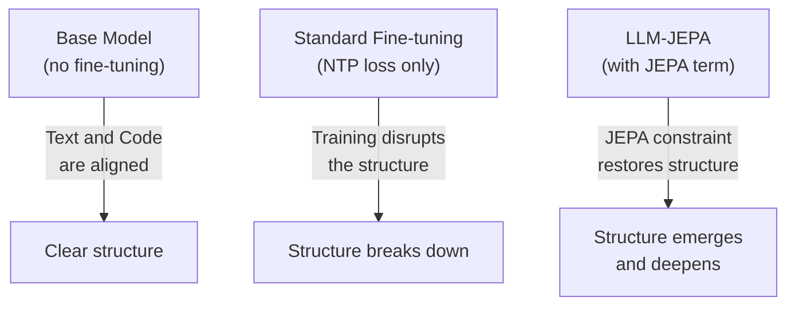

# How JEPA Restructures the Embedding Space

Empirical accuracy gains are nice, but what's *actually happening* inside the model? Why does JEPA improve reasoning so consistently?

## The transformation is almost linear

The paper makes a striking observation: **LLM-JEPA enforces an approximately linear transformation between Text and Code embeddings.**

To see this, they compute the singular value decomposition (SVD) of the difference matrix `Enc(Text) - Enc(Code)`:

| Setup | Top 100 Singular Values | Interpretation |
|-------|------------------------|-----------------|
| Base model (unfinetuned) | ~310.73 (avg) | High variance; chaotic relationship |
| Standard fine-tuning | ~341.80 (avg) | Even higher variance |
| LLM-JEPA (k=0) | ~6.82 (avg) | **Orders of magnitude smaller** |

This means LLM-JEPA compresses the mapping into a very narrow subspace. The transformation from Text to Code is constrained to a low-dimensional manifold, almost like a linear projection.

Why does this matter? A low-rank transformation is easier for the model to *learn and generalize*. Instead of memorizing a chaotic, high-variance relationship, the model learns a clean, structured one.

## Visualizing structure: t-SNE plots

To see this geometrically, the paper uses t-SNE (a dimensionality reduction technique) to visualize how Text and Code clusters are arranged:

Concretely:
- **Base model**: Text and Code clusters are already somewhat aligned (this makes sense—the pretrained model already understands relationships).
- **Standard fine-tuning**: The alignment *gets worse*. Training purely on next-token prediction disrupts the natural structure.
- **LLM-JEPA**: Structure re-emerges, even more pronounced than the base model.

This is a key insight: **LLM-JEPA isn't creating structure from scratch; it's preserving and sharpening structure the model already has.**

## Linear regression confirms the hypothesis

To test the "linear transformation" hypothesis quantitatively, the paper fits a least-squares regression from `Enc(Text)` to `Enc(Code)`:

Minimize: ||Enc(Text)·X - Enc(Code)||²

| Setup | Regression Error | Interpretation |
|-------|-----------------|-----------------|
| Base model | 3953.11 | High error; not truly linear |
| Standard fine-tuning | 3035.01 | Slightly better but still chaotic |
| LLM-JEPA (k=0) | **4.04** | Nearly perfect linear fit |

The errors drop by orders of magnitude. This confirms that LLM-JEPA creates a remarkably clean, almost-perfectly-linear mapping between views.

## Why linear structure helps reasoning

A linear, low-rank structure is a form of *compression*. Instead of storing complex, high-dimensional relationships, the model learns a few key directions that matter. This serves as implicit regularization:

- **Generalization**: The model learns *what matters*, not memorizing noise.
- **Compositionality**: Linear transformations compose cleanly—you can reason about how features flow through the model.
- **Robustness**: A constrained embedding space is more stable to distribution shift (new datasets, new tasks).

This geometric insight explains why LLM-JEPA resists overfitting: you can't overfit to noise in a low-rank space.
