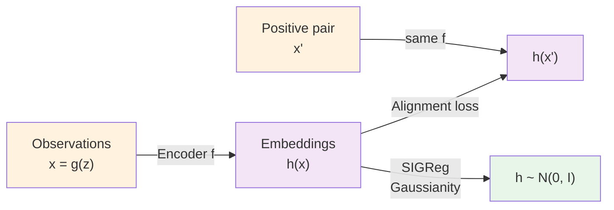

# LeJEPA: Architecture and Objectives

## The Two-Objective Approach

LeJEPA combines two separate objectives to prevent collapse and encourage learning:

1. **Alignment loss**: Pull positive pairs together. Minimize ||h(z') - h(z)||², where h is the learned representation and (z, z') are positive pairs from the OU transition. This encourages the representation to be predictive.

2. **Gaussianity constraint**: Keep the embedding distribution Gaussian. h(z) ~ N(0, I_n), enforced via SIGReg (Sketched Isotropic Gaussian Regularization). This prevents feature collapse — the problem where h becomes a constant or degenerates.

> **Why both?** Alignment alone doesn't prevent collapse; a model could pull all pairs together by mapping everything to zero. Gaussianity alone doesn't encourage learning; a random representation can be Gaussian without being informative. You need both constraints working together.

## The Training Objective

Formally, the optimization problem is:

min_h ||h(z') - h(z)||² subject to h(z) ~ N(0, I_n)

In practice, the whitening constraint (zero mean, identity covariance) is enforced approximately via SIGReg, which sketches the covariance and pushes h(z) toward an isotropic Gaussian.

A key observation: **with whitening, minimizing distance is equivalent to maximizing correlation.** Here's why:

If Cov(h(z)) = I_n, then E[||h(z)||²] = E[||h(z')||²] = n (the trace of identity covariance is n). So:

||h(z') - h(z)||² = E[||h(z')||² - 2⟨h(z'), h(z)⟩ + ||h(z)||²] = 2n - 2Σ_i E[h_i(z') h_i(z)]

Minimizing this is equivalent to maximizing the correlation Σ_i E[h_i(z') h_i(z)].

**The question becomes**: among all representations h that stay Gaussian and whitened, which maximizes correlation between positive pairs?

The answer is: **a pure linear map, h(z) = Qz with Q orthogonal.**

## Why Not Other Architectures?

The paper doesn't assume any particular encoder architecture — just that f is measurable and the output dimension matches the latent dimension. This works with MLPs, CNNs, Vision Transformers, whatever.

The theory holds because it operates on the *properties* of h (linearity, Gaussianity, correlation), not the implementation details. A deep neural network trained with LeJEPA will, under these constraints, naturally converge to learning a rotation of the latents.

## Stability in Practice

In practice, SIGReg doesn't achieve *perfect* Gaussianity, and alignment doesn't reach *exactly* optimal loss. The paper addresses this with Theorem 3: if objectives are "approximately satisfied," the recovery error degrades smoothly.

Alignment gap δ and whitening error ε are measured during training. Small deviations lead to small errors in recovery — not a sudden cliff. This is crucial for practitioners: you don't need perfection, just good enough.

## Connection to Representation Learning

This objective function is not arbitrary. LeJEPA builds on a principled line of work in self-supervised learning:

- **InfoNCE** (contrastive): explicitly contrasts positive pairs against negatives.
- **VICReg** (variance/covariance regularization): constrains second moments to prevent collapse.
- **LeJEPA/SIGReg** (Gaussian regularization): explicitly enforces Gaussianity of embeddings.

All three are part of a hierarchy of collapse-prevention mechanisms, ranging from implicit to explicit, weak to strong. The paper tests all three (Table 1) and shows that when Gaussian assumptions hold, SIGReg performs best at scale.

The alignment loss ensures the model is predictive. SIGReg ensures it learns structure, not just collapse avoidance. Together, they force a linear, rotated recovery of the world's latent variables.
