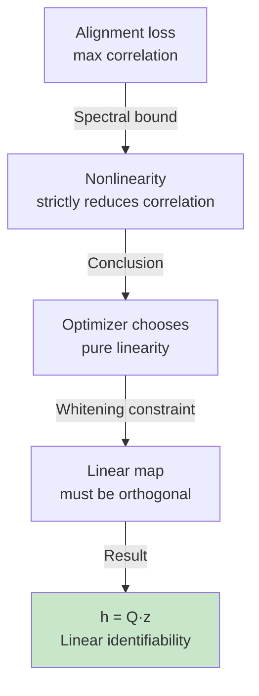

# Why Nonlinearity Reduces Correlation

## The Spectral Bound in Action

Recall the key formula from spectral analysis:

For any representation h_i decomposed into Hermite modes:
E[h_i(z') h_i(z)] = w_1·ρ + w_2·ρ² + w_3·ρ³ + ...

Since ρ ∈ (0, 1) and Σ w_k = 1, this sum is always ≤ ρ, with equality only when w_1 = 1 (pure linear).

**The interpretation**: Each degree of nonlinearity "costs" exponentially in correlation.

## Concrete Example: 2D Gaussian

Imagine a 2D Gaussian latent space (e.g., x and y position). A linear representation would be:

h(z) = [a·x + b·y, c·x + d·y]

Correlation with the next view: ρ (full strength).

Now consider a quadratic nonlinearity:

h(z) = [x + ε·x², y + ε·y²]

The nonlinear terms x² and y² are second-degree Hermite modes (He_2). They contribute with weight ρ², not ρ.

So the correlation drops from ρ to (1-ε)·ρ + ε·ρ² = ρ - ε·ρ(1-ρ). For ρ = 0.8 and ε = 0.1, correlation drops from 0.8 to 0.752. **Even small nonlinearity hurts.**

## Why This Matters for Learning

The LeJEPA loss is:

L(h) = E[‖h(z') - h(z)‖²] = 2n - 2·Σ_i E[h_i(z') h_i(z)]

To minimize L, the optimizer wants to maximize Σ_i E[h_i(z') h_i(z)].

Given the spectral bound, the optimizer should push all w_1 → 1 (make everything linear), not mix in nonlinear modes.

**Alignment incentivizes linearity.**

## The Role of ρ (Correlation Strength)

The parameter ρ (from the OU transition) controls how much linearity is rewarded:

- **High ρ (ρ → 1)**: Positive pairs are nearly identical. The gap between linear (ρ) and quadratic (ρ²) is large (ρ - ρ² = ρ(1-ρ) ≈ 0, but the *ratio* is 1/(ρ) ≈ 1). Even small nonlinearity is heavily penalized.

- **Low ρ (ρ → 0)**: Positive pairs are nearly independent. The incentive for linearity is weaker (correlation is already small). But even here, linearity is optimal.

The experiments in the paper confirm this: **Table 1 grid search shows best linear recovery at low λ (low Gaussianity weight) and high ρ (strong correlations between views).**

## Nonlinearity vs. Optimization Difficulty

One subtlety: **Theorem 1 is about the global optimum, not what the optimizer finds.**

In practice, the encoder might get stuck in a local minimum with some nonlinearity, especially if:

- The encoder capacity is too high (it can find nonlinear solutions).
- The correlation ρ is low (the penalty for nonlinearity is weak).
- Training is stopped before convergence.

This is why **Theorem 3 (approximate identifiability) matters**: it bounds the recovery error based on how far the learned h is from the theoretical optimum. If the optimizer only partially achieves linearity (alignment gap δ > 0), the theory predicts graceful degradation, not catastrophic failure.

## Bringing It Together

The spectral bound is the mathematical heart of LeJEPA's identifiability:

1. Alignment maximizes correlation.
2. The spectral bound (from Hermite decomposition) shows that correlation is maximized by pure linearity.
3. Whitening forces the linear map to be orthogonal.
4. Orthogonal maps are the only invertible transformations of a Gaussian that preserve Gaussianity.

Each step follows inevitably from the previous one. This is why the guarantee is so strong: **the math forces linearity into the solution.**

