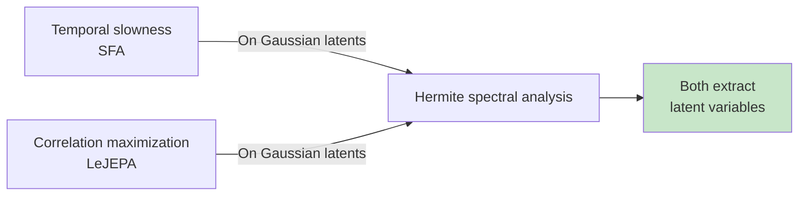

# Connection to Slow Feature Analysis

## What is Slow Feature Analysis?

**Slow Feature Analysis (SFA)** is a classical unsupervised learning method developed by Wiskott & Sejnowski (2002). The core idea: in temporal data, the slowest-changing features are usually the most meaningful factors of variation.

**SFA objective**: Learn a function h that minimizes the temporal slowness:

Minimize: Σ_t (dh(x_t)/dt)² = Σ_t ‖h(x_{t+Δt}) - h(x_t)‖²

subject to output whitening and orthogonality constraints.

In other words: find the representation that changes as slowly as possible across time (or across frames in video).

## Why Does SFA Matter?

SFA has strong theoretical foundations:

1. **Identifiability**: Under certain conditions (temporal dependencies, non-Gaussian latents), SFA provably recovers disentangled factors — independent latent variables.

2. **Empirical success**: SFA has been used for decades in vision (pose estimation from video), robotics, and neuroscience.

3. **Connection to temporal correlation**: The slowness principle is mathematically related to spectral analysis of the transition operator — the same tool used in Theorem 1!

## The Relationship: LeJEPA ≈ SFA on Gaussian Latents

The paper proves (Appendix F): **JEPA objectives with alignment + Gaussian regularization empirically recover Slow Feature Analysis.**

More precisely: the learned h from LeJEPA tends to extract the slowest features of the latent process, which (under Gaussian assumptions) are the latent variables themselves.

**Why the connection?**

Both SFA and LeJEPA exploit temporal/correlation structure:
- **SFA** minimizes temporal change: min Σ_t ‖h(z_{t+Δt}) - h(z_t)‖²
- **LeJEPA** maximizes correlation (via OU transition): min E[‖h(z') - h(z)‖²]

The OU transition z' = ρz + √(1-ρ²)η is a discrete-time analog of temporal evolution. When z is Gaussian, the slowest features are exactly the latent variables themselves (by the spectral analysis via Hermite polynomials).

## Key Insight from SFA Theory

SFA theory tells us: **the slowest (most predictable) component of the latent process contains the factor of variation.**

For Gaussian latents, the spectral decomposition (Hermite basis) reveals this structure explicitly:
- He_1(z) = z (linear) has eigenvalue ρ, the slowest feature.
- He_k(z) (degree-k nonlinearity) has eigenvalue ρ^k < ρ, faster decaying.

The LeJEPA objective naturally "finds" the slowest features by maximizing correlation. But because it's working with Gaussian latents in the Hermite basis, it's forced to extract exactly the latents, up to rotation.

## The Inversion of Classical ICA

Here's a remarkable inversion:

**Classical nonlinear ICA (e.g., via SFA)**: Uses temporal/non-stationarity to separate sources. Works for almost any latent distribution EXCEPT Gaussian. (Gaussian is unidentifiable in standard ICA.)

**LeJEPA on Gaussian latents**: Uses alignment + explicit Gaussianity to separate sources. Works uniquely for Gaussian latents.

The two approaches are complementary:
- If you have temporal data and non-Gaussian latents → use SFA.
- If you have paired views (e.g., video frames) and Gaussian latents → use LeJEPA.

## Quantitative Connection

The paper provides a detailed comparison in Appendix F:

**SFA objective** (slowness minimization):
Σ_t ‖h(z_{t+1}) - h(z_t)‖² = Σ_t ‖ρh(z_t) + √(1-ρ²)Qη_t - h(z_t)‖²
= Σ_t (1 - ρ)² ‖h(z_t)‖² + (higher-order terms)

For small (1-ρ) (highly correlated frames), this is dominated by ‖h(z_t)‖² minimization, which under whitening drives h toward linearity.

**LeJEPA objective** (correlation maximization):
max E[h(z') h(z)] = max E[(ρh(z) + √(1-ρ²)Qη)(h(z))]
= max ρ E[‖h(z)‖²] (to leading order)

Again, under whitening, this naturally extracts slow (large ρ), linear features.

The quantitative analysis shows that SFA and LeJEPA are minimizing related objectives on Gaussian latents.

## Why This Connection Is Important

1. **Grounding in classical theory**: The LeJEPA results are not a new phenomenon — they're a modern instantiation of SFA principles on Gaussian latents with explicit Gaussianity constraints.

2. **Predicting failure modes**: SFA theory predicts failure on non-Gaussian latents (Theorem 2 validates this empirically).

3. **Connecting temporal to relational learning**: SFA uses temporal structure (sequential frames); LeJEPA uses relational structure (paired views). Both extract the same features on Gaussian latents.

4. **Historical perspective**: SFA is 20+ years old. The connection shows that LeJEPA is not a radical departure — it's a rigorous, modern formulation of slow-feature principles.

## Limitations of the Connection

The connection is not exact:
- **SFA** assumes infinite or very long time series; **LeJEPA** works with finite paired views.
- **SFA** theory focuses on non-Gaussian latents where temporal non-stationarity is available; **LeJEPA** requires Gaussian latents where spectral structure is known.
- **SFA** proofs are about steady-state behavior; **LeJEPA** proofs are about finite-horizon optima.

But the core principle — slowness = latent factors — connects them at a deep level.

