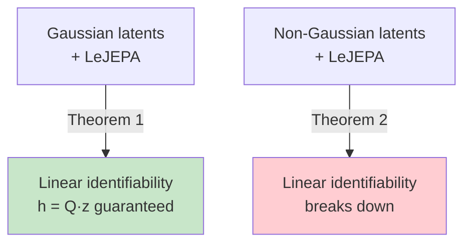

# Theorem 1: Linear Identifiability in Gaussian Worlds

## The Statement

**Theorem 1** (LeJEPA Linear Identifiability): 

Consider a Gaussian world (Section 3.1.1). Let h: ℝⁿ → ℝⁿ be any measurable map with h(z) ~ N(0, I_n). Then:

1. The loss satisfies L(h) ≥ 2(1 - ρ)n, with equality if and only if h(z) = Qz for some orthogonal Q ∈ O(n).
2. At any optimum, h(z') | h(z) ~ N(ρ h(z), (1 - ρ²)I_n).

In plain English: **The only way to maximize correlation (minimize loss) under Gaussian and whitening constraints is to learn a rotation of the true latents.**

## Proof Sketch

Here's how the proof works:

**Step 1**: Minimize L is equivalent to maximize correlation Σ_i E[h_i(z') h_i(z)] (this follows from whitening).

**Step 2**: Decompose h_i into Hermite modes: h_i = Σ_k w_k He_k.

**Step 3**: Apply the spectral bound (Equation 4):
E[h_i(z') h_i(z)] = w_1 ρ + w_2 ρ² + w_3 ρ³ + ... ≤ ρ

Equality holds only when w_1 = 1 (pure linearity).

**Step 4**: Sum over all dimensions i. The loss at optimum is:
E[‖h(z') - h(z)‖²] = 2n - 2Σ_i E[h_i(z') h_i(z)]

To minimize, maximize each correlation. The spectral bound forces each h_i to be linear: h_i(z) = Q_i · z (one row of a matrix Q).

**Step 5**: The whitening constraint Cov(h(z)) = I_n forces Q to be orthogonal. Here's why:
h(z) = Qz implies Cov(h(z)) = E[Qzz^T Q^T] = Q E[zz^T] Q^T = QI_n Q^T = QQ^T

For Cov(h(z)) = I_n, we need QQ^T = I_n, which is exactly the definition of orthogonality.

**Step 6**: The transition property follows by substitution:
h(z') = Qz' = Q(ρz + √(1-ρ²)η) = ρQz + √(1-ρ²)Qη = ρh(z) + √(1-ρ²)Qη

Since Q is orthogonal, Qη ~ N(0, I_n) (rotation preserves Gaussian distribution), and Qη ⊥ h(z).

## Interpretation: What This Means

The theorem says: **if you train a neural network with LeJEPA on Gaussian-latent worlds, there is no choice — it MUST learn a rotation of the true latents.**

The only ambiguity is the rotation itself. An isotropic Gaussian has rotational symmetry — there's no canonical basis. So h(z) = Qz is correct "up to rotation," which is unavoidable.

This is a strong guarantee:

- The representation recovers all latent variables (nothing is lost or scrambled).
- The structure is preserved (positions stay independent from colors).
- Higher-level reasoning (planning, composition) can be done in this learned latent space.

## What About the Transition?

The second part of Theorem 1 characterizes the transition in learned space:

h(z') | h(z) ~ N(ρ h(z), (1 - ρ²)I_n)

This says: given the current learned latent h(z), the next view's latent is a Gaussian centered at ρ h(z) with covariance (1 - ρ²)I_n.

This is exactly the OU transition, preserved in the learned coordinates. The encoder recovers not just the latents, but the correct transition dynamics.

## The Contrast with Non-Gaussian Latents

Theorem 1 is **specific to Gaussian latents**. If the latents are non-Gaussian (say, heavy-tailed or uniform), the spectral structure is different, and the spectral bound does not force linearity.

This is why the **converse direction (Theorem 2)** is so important: it shows that Gaussian is not just sufficient, but **necessary** for linear identifiability.

