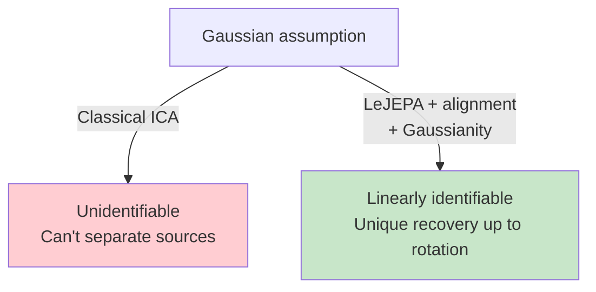

# Theorem 2: The Gaussian is Unique

## The Question

Theorem 1 shows that **for Gaussian latents, LeJEPA achieves linear identifiability.** But is the Gaussian special? Could any isotropic distribution work?

**Theorem 2** answers this: among all world models satisfying the paper's assumptions (independence, stationarity, additive-noise transitions), **the Gaussian is the UNIQUE distribution for which linear identifiability holds.**

This is a stunning result: the Gaussian is both necessary and sufficient.

## The Converse Direction

The proof uses **Sturm-Liouville (SL) theory**, a classical tool from differential equations.

For any latent distribution p(z), the transition operator has eigenvalues and eigenfunctions characterized by an SL equation. A key property of SL theory is that the first non-constant eigenfunction φ₁ (the slowest, most predictable feature) is **always monotonic**.

For linear identifiability, we need φ₁ to be **affine**: φ₁(z) = az + b (linear plus a constant).

**Affine = linear for the purposes of identifiability** (a linear map is orthogonal under the whitening constraint, which recovers latents up to rotation).

Now here's the key insight: **what latent distributions p(z) have an affine slowest eigenfunction?**

## From Affinity to Gaussianity

If φ(z) = az + b is an eigenfunction of the transition operator, then:

T φ = λ φ for some eigenvalue λ.

Taking the derivative with respect to z: T (∇φ) = λ (∇φ), so T(a) = λ·a.

For a linear function, the derivative a is constant. The eigenvalue equation then becomes an **ordinary differential equation for the score function** ∇log p:

d/dz (log p(z)) must be linear.

Solving this ODE: log p(z) ∝ -z², which integrates to p(z) ∝ exp(-z²/2), the Gaussian.

## Why This Is Unique

The argument applies per-component (since latents are independent), and the conclusion lifts to the joint distribution: **only the Gaussian satisfies the constraint that the slowest eigenfunction is affine.**

All other latent distributions (uniform, exponential, heavy-tailed, mixture, etc.) have a first eigenfunction that is monotonic but **not affine** — curved, not straight.

## Experimental Validation: The Distribution Sweep

Figure 4b in the paper validates this beautifully. The latent distribution is swept through the **generalized normal family** with shape parameter α:

- α → 0: heavy-tailed (close to Laplace)
- α = 1: Laplace
- α = 2: **Gaussian** (the target)
- α → ∞: uniform

Linear recovery R² (the key measure of identifiability) **peaks sharply at α = 2** across all three objectives (SIGReg, VICReg, InfoNCE).

The peak is not just a local maximum — it's a global optimum, and nearby distributions show degraded performance. This is exactly what Theorem 2 predicts: Gaussian is unique, not just good.

## What Happens with Non-Gaussian Latents?

If the latents are non-Gaussian but you still apply LeJEPA, what breaks?

The Hermite polynomial spectral decomposition no longer applies. The slowest eigenfunction is not linear, so the alignment loss does not strictly prefer linearity. The optimizer can find solutions that are nonlinear without paying a large cost in correlation.

Result: **linear identifiability fails, and the representation entangles factors.**

This is validated empirically in the Reacher experiments (Table 2): when RL trajectories (non-Gaussian, due to policy constraints) are used instead of Gaussian OU pairs, R² drops from ~0.95 to ~0.5, and planning performance degrades.

## Connection to ICA Folklore

Interestingly, there's a classical result in nonlinear ICA: **the Gaussian is the ONE distribution where source separation fails in standard ICA.**

This seems backwards! But the settings are different:

- **Classical ICA**: You observe x = g(As), where A is an unknown mixing matrix and s are sources. Without structure, you can't separate them if sources are Gaussian.

- **LeJEPA/this paper**: You observe x = g(z) with alignment + Gaussianity constraints. The Gaussian is the UNIQUE distribution that is linearly identifiable.

The paper notes this inversion wryly: "Linear ICA: the Gaussian is the one distribution where source separation fails. Our nonlinear setting: it is exactly what enables it."

The key difference is that LeJEPA adds two strong constraints (alignment + Gaussianity enforcement) that together flip the problem.

