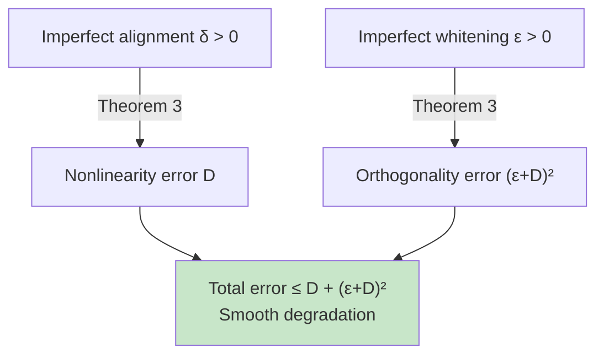

# Theorem 3: Approximate Identifiability

## When Objectives Are Only Approximate

Theorems 1 and 2 assume **perfect** satisfaction of the LeJEPA objectives:
- Alignment reaches its global minimum.
- The embedding distribution is exactly Gaussian (Cov(h(z)) = I_n).

In practice, neither is true. Training stops at some finite loss value, and SIGReg doesn't enforce perfect Gaussianity. So the question is: **how much does the guarantee degrade?**

**Theorem 3** answers this with a graceful degradation bound.

## The Bound

Let δ and ε measure how far from perfect the representation is:

- **δ** (alignment gap): δ = L(h) - 2(1-ρ)tr(Cov(h(z))). This is how far the loss is from optimal.
- **ε** (whitening error): ε = ‖Cov(h(z)) - I_n‖_F. This is how far the embedding covariance is from identity.

Define D = δ / (2ρ(1-ρ)).

**Theorem 3 states**: There exists an orthogonal Q such that:

E[‖h(z) - Qz‖²] ≤ D + (ε + D)²

## Interpretation: Two Error Terms

The bound has two pieces:

1. **D term**: Measures the cost of nonlinearity. If δ = 0 (perfect alignment), then D = 0 and all nonlinearity vanishes. As δ increases (worse alignment), D increases, allowing more nonlinearity in the solution.

2. **(ε + D)² term**: Measures deviation of the linear part from orthogonal. Even if the representation is linear, it might not be perfectly orthogonal due to whitening error ε.

## Practical Implications

**Key insight from the paper**: In practice, **D dominates — alignment is hard, whitening is essentially free.**

Why? Because:
- SIGReg directly enforces the covariance structure, making ε small.
- Alignment is a looser objective, so δ can be larger.
- Therefore, recovery error scales roughly as δ / (2ρ(1-ρ)), driven by the alignment gap.

This has a practical lesson: **focus your training effort on getting alignment right. Whitening is less critical.**

## Smooth Degradation vs. Cliff

The bound shows that small deviations in the objectives lead to small recovery errors:

- If alignment is 95% perfect (δ small), recovery error is small.
- If alignment is 80% perfect (δ moderate), recovery error is moderate.
- There is no cliff where performance suddenly collapses.

This is crucial because:
1. It justifies using finite-sample training (you won't hit the population-level optimum exactly).
2. It explains why approximate Gaussianity is tolerable.
3. It matches empirical observations: training loss is a good proxy for identifiability.

## Empirical Validation (Figure 4a)

The paper validates Theorem 3 by computing ε, δ, the bound D + (ε + D)², and the actual recovery error E[‖h(z) - Qz‖²] for each training run.

Figure 4a plots the actual error vs. the bound. All points lie below the diagonal (actual ≤ bound), confirming that Theorem 3 holds empirically across:
- 2D grid searches
- Different mixing functions
- Scaling experiments (up to 1024-D)
- Latent distribution sweeps

The few near-zero outliers reflect finite-sample estimation noise in ε and δ, not violations of the theorem.

## Handling Dimension Mismatch

One limitation noted: Theorem 3 assumes the encoder output dimension matches the latent dimension (m = n).

**What if m < n?** The Gaussianity constraint doesn't uniquely determine which subspace is learned. The representation might use superposition (mixing multiple latent dimensions into one output dimension).

**What if m > n?** Extra output dimensions must either collapse or encode redundancy.

These mismatched cases are important for practice (encoders might naturally produce different dimensions), but they're left as open problems.

