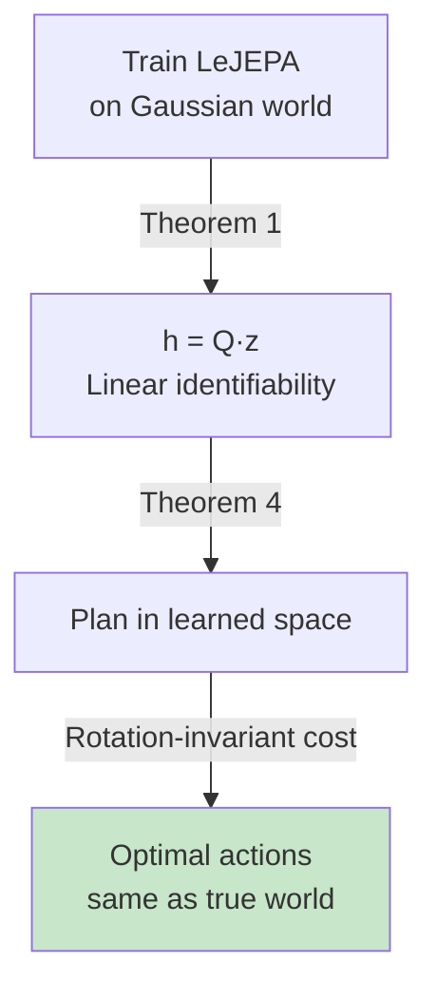

# Theorem 4: Optimal Latent Planning

## Why Planning Matters

Theorems 1-3 characterize what the encoder recovers. But **why does linear identifiability matter in practice?** 

The answer: **it enables optimal planning in learned latent space.**

A learned world model is only useful if you can use it to plan actions to achieve goals. Theorem 4 formalizes this connection.

## The Setup

Consider a finite-horizon optimal control problem (e.g., "reach this goal position"):

Minimize: Σ_{t=1}^T ℓ(z_t, a_t) + ℓ_T(z_T)

where:
- z_t is the true latent state at time t
- a_t is the action (what the agent does)
- ℓ is the stage cost (e.g., distance to goal)
- ℓ_T is the terminal cost

## The Rotation-Invariance Condition

**Key assumption**: The costs must be **O(n)-invariant** (invariant to rotations):

ℓ(Rz, a) = ℓ(z, a) for all R ∈ O(n)
ℓ_T(Rz) = ℓ_T(z) for all R ∈ O(n)

**What does this mean?** Rotation-invariant costs include:
- **Goal-reaching**: minimize ‖z - z_goal‖² — the distance is the same no matter which way you rotate both states.
- **Energy minimization**: minimize ‖a‖² — the action cost doesn't depend on your coordinate system.

**What is NOT rotation-invariant:**
- Minimizing just z_1 (the first coordinate) — a rotation changes which coordinate is "first."
- Task-specific costs that care about absolute coordinates (e.g., "reach position (1, 0)" not "(0, 1)").

This assumption is reasonable for many robotic and control tasks, where you care about *relationships* (distances, angles) rather than absolute coordinates.

## The Guarantee

**Theorem 4 states**: If h(z) = Qz (linear identifiability), then the optimal plan in learned latent space is **identical to the optimal plan in the true world:**

V̂*(h(z_0)) = V*(z_0)
â*_{1:T}(h(z_0)) = a*_{1:T}(z_0)

In words:
- The optimal value (expected cumulative cost) is the same.
- The sequence of optimal actions is the same.

This is profound: **you can plan entirely in the learned latent space and get the same solution as if you had access to the true world.**

## Why This Works

The intuition is simple: a rotation Q just changes the coordinate system. If the costs are rotation-invariant, they "don't care" about the coordinate system. So the optimal plan in z-space and Q·z-space are the same.

Formally, the proof substitutes z' = Qz into the Bellman equation and shows that the value function transfers: V̂ = V ∘ Q.

## Practical Impact

Theorem 4 justifies using LeJEPA for planning:

1. **Learn a representation** with LeJEPA (which, by Theorem 1, achieves linear identifiability on Gaussian worlds).
2. **Plan in the learned latent space** using standard RL/control algorithms.
3. **Get optimal solutions** (for rotation-invariant costs) without any loss compared to planning in the true world.

No approximation error, no degradation. Perfect transfer from representation learning to planning.

## Experimental Validation: Reacher Task

The paper tests this on the DMC Reacher robot (2D joint angles). The cost is goal-reaching: minimize distance to a goal configuration.

Results (Figures 4c, 4d, Figure 5):
- **Gaussian OU encoder**: Control cost is statistically indistinguishable from the oracle (ground-truth latents). Optimal plans in learned space match optimal plans in true space.
- **RL trajectory encoder** (non-Gaussian): Control cost is higher because linear identifiability breaks (R² ≈ 0.5). Plans are suboptimal.
- **Across all models**: Control cost decreases monotonically with R² (linear identifiability). The relationship is direct and predictable.

Figure 5 shows actual trajectories: the Gaussian encoder produces straight-line paths in latent space that decode to near-optimal joint-space trajectories. The RL encoder's latent plans are curved because the representation is nonlinear, introducing suboptimality.

## Limitations and Extensions

Theorem 4 assumes:
1. **m = n** (encoder output dimension matches latent dimension).
2. **Rotation-invariant costs** (the big one).
3. **Perfect linear identifiability** (h = Qz exactly).

Extensions left to future work:
- **Action-conditioned dynamics**: The paper focuses on state dynamics; incorporating actions as interventions opens up causal representation learning.
- **Costs that break rotation-invariance**: Many real tasks care about absolute coordinates, not just relationships. Extending the theory to task-specific costs is open.

But for a large class of problems (reaching, balancing, path-following in rotation-invariant coordinates), Theorem 4 provides a direct path from representation learning to optimal planning.

