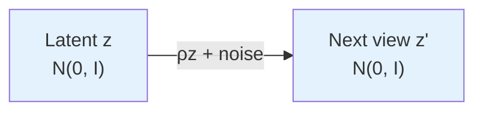

# The Gaussian World Model

## The Setup: Latents, Observations, and Transitions

Imagine a world with clean latent variables: position, velocity, color, lighting. These are the true factors of variation, z ∈ ℝⁿ. But you never see them directly.

An unknown, nonlinear process g scrambles them into the observations you actually receive: x = g(z). Think of g as rendering a 3D scene into camera pixels, or mapping physical states to noisy sensor readings. The goal of learning is to train an encoder f such that f(x) recovers z (or something equivalent).

## Three Key Assumptions

The paper assumes the world satisfies three properties:

**Independence**: Each latent variable evolves independently. Position changes don't affect color changes; they're decoupled.

**Stationarity**: The data distribution doesn't change over time. The probability of seeing any latent configuration today is the same as tomorrow.

**Additive noise**: When a latent variable transitions (e.g., from z_i to z'_i), the change is a deterministic function m_i(z_i) plus random noise η_i. This is the natural model for physical systems: a deterministic signal plus measurement or process noise.

Together, these define a broad class of realistic world models. Now comes the key question: **what should the latent distribution p(z) be?**

## Why Gaussian Latents?

The paper assumes z ~ N(0, I_n): standard normal, zero mean, identity covariance.

This is justified on two grounds:

1. **Maximum entropy**: Given only the constraint of zero mean and unit covariance, the Gaussian is the distribution that assumes the least additional structure. It's the most "unbiased" choice.

2. **Central limit theorem**: Real-world latent variables are often aggregates of many micro-variables (e.g., "position" is the sum of many muscle activations). By the central limit theorem, these aggregates tend toward Gaussianity.

## The Ornstein-Uhlenbeck Transition

Here's a subtlety: if z ~ N(0, I_n) and you transition via z' = m(z) + η with independent noise, does z' still have the same distribution?

Only if m is a very specific form. For Gaussian latents under additive noise with stationarity, the unique transition is the **Ornstein-Uhlenbeck (OU) process**:

z' = ρz + √(1 - ρ²) η,  where η ~ N(0, I_n) and ρ ∈ (0, 1)

This preserves the Gaussian marginal: E[z'] = 0, Var(z') = I_n. The parameter ρ controls correlation between views — ρ → 1 means the two views are nearly identical, ρ → 0 means independent samples.

Why is this transition special? Because the Gaussian is a **fixed point of convolution up to rescaling**. It's the only distribution where adding a linearly scaled version of itself plus independent noise preserves the distribution. This uniqueness is the engine behind the theory.

## Positive Pairs and Self-Supervised Learning

In self-supervised learning, you don't have labels. Instead, you create positive pairs from the same underlying content: two frames of a video, two augmentations of an image, or two nearby time steps of a trajectory.

In our language: z and z' are two views of the same world state, generated by the OU transition. The learner sees x = g(z) and x' = g(z') and must discover that they came from a correlated pair (z, z').

The alignment loss will pull h(x) and h(x') together (where h = f ∘ g is the composed representation). The Gaussian regularizer will keep h(z) ~ N(0, I_n). Together, these objectives force the learned h to be a rotation of the true z.
