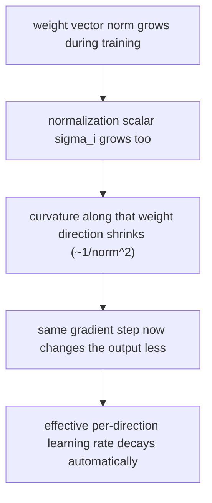

## Why does normalization make learning *stable*, not just invariant?

The invariance table tells you the model's *output* doesn't change under certain
re-scalings. That's a fact about the function the network computes. It says
nothing yet about *training* — whether gradient descent on the normalized model
behaves differently than on the un-normalized one. The paper's geometric analysis
answers exactly that question, using a tool from information geometry: the
**Fisher information matrix**, which measures how much a small step in parameter
space actually changes the model's output distribution.

> "We show that the normalization scalar σ can implicitly reduce learning rate and
> makes learning more stable." — *Section 5.2*

You don't need the full Riemannian-manifold derivation to get the useful
intuition. Here's the mechanism in plain terms:

### A growing weight vector quietly shrinks its own learning rate

Suppose, partway through training, the norm of some neuron's weight vector *wᵢ*
has doubled — but because of the normalization, the model's *output* is
unchanged (this is exactly the weight-vector invariance from the previous
lesson... except recall layer norm is *not* invariant to a single weight vector's
re-scaling, so this argument applies most directly to batch norm and weight norm,
and the paper extends an analogous argument to the gain parameters in layer norm).

> "If the norm of the weight vector wᵢ grows twice as large, even though the
> model's output remains the same, the Fisher information matrix will be
> different. The curvature along the wᵢ direction will change by a factor of ½
> because the σᵢ will also be twice as large." — *Section 5.2.2*

Read that as: the *same size gradient step* now moves the model's predictions
*half as much* as it used to, because the normalization scalar σᵢ has grown right
alongside the weight norm. The optimizer hasn't been told to slow down — the
geometry of the parameter space has changed under it, automatically damping
further updates to that direction.

The paper calls this an implicit **early-stopping effect**: directions in
parameter space that have already grown large get automatically harder to keep
changing, which "helps to stabilize learning towards convergence" (*Section
5.2.2*). Nobody hand-tuned a learning-rate schedule for this — it falls out of the
normalization's own statistics moving along with the weights.

### The gain parameter learns magnitude more robustly

Separately, the paper compares two ways a model can grow a neuron's effective
magnitude: changing the raw weight norm in an unnormalized model, versus changing
the explicit gain parameter *g* in a normalized one. The conclusion:

> "Learning the magnitude of incoming weights in the normalized model is...
> more robust to the scaling of the input and its parameters than in the standard
> model." — *Section 5.2.2*

In an unnormalized model, how much a gradient step on the weight magnitude
actually changes the output depends on the scale of the *input*, *x* — large
inputs make the same-size step do something very different than small inputs do.
In a normalized model, that dependency on raw input scale is gone: the gain
parameter's update only depends on the magnitude of the prediction error itself.
That's one more way normalization decouples "how much should I update" from
"how big do my numbers happen to be right now."
