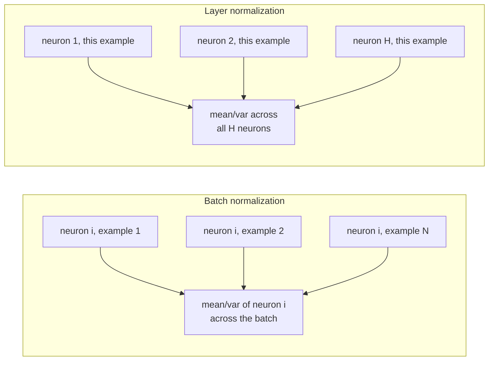
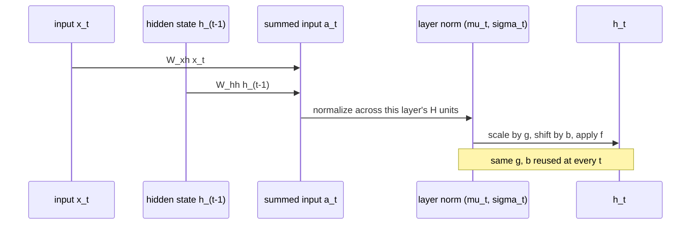

## The equations: same shape, different axis

Recall the feed-forward setup from the paper's background section. Layer *l* has
weight matrix *Wˡ*, and the summed input to its *i*-th neuron, before the
non-linearity, is *aᵢˡ = wᵢˡᵀhˡ*. Batch normalization rescales that summed input
using statistics gathered **across the training cases**:

> µᵢˡ = E[aᵢˡ] over the data distribution
> σᵢˡ = √( E[(aᵢˡ − µᵢˡ)²] ) over the data distribution — *Eq. 2*

Layer normalization keeps the same shape of formula but changes what you average
over. Instead of one mean/variance per neuron estimated across many training
cases, you compute **one mean/variance per training case**, estimated across all
*H* neurons in the layer:

> "We thus compute the layer normalization statistics over all the hidden units in
> the same layer... µˡ = (1/H)·Σᵢ aᵢˡ, σˡ = √( (1/H)·Σᵢ (aᵢˡ − µˡ)² )" — *Section 3, Eq. 3*

The key structural difference, in the paper's own words:

> "All the hidden units in a layer share the same normalization terms µ and σ, but
> different training cases have different normalization terms." — *Section 3*

That's the opposite of batch norm, where all training cases in a batch *share* the
normalization terms for a given neuron, but different neurons have different
terms.

After computing µ and σ either way, both methods apply the *same* kind of affine
recovery: a learned per-neuron gain *g* and bias *b*, applied after normalizing
but before the non-linearity *f*:

> hᵢ = f( (gᵢ/σᵢ)·(aᵢ − µᵢ) + bᵢ )

> **Wait — if every layer gets forcibly re-centered and re-scaled, doesn't that
> throw away useful information, like "this neuron is generally more active than
> that one"?** That's exactly what *g* and *b* are for. Normalization wipes out
> the raw scale and offset; *g* and *b* are then free, *learned* parameters that
> let the network put back whatever scale and offset actually helps — but now
> decoupled from the raw, possibly-exploding magnitude of *aᵢ* itself.

### Applying it inside an RNN

For a standard RNN, the summed input at time *t* is *aₜ = Whh·hₜ₋₁ + Wxh·xₜ*.
Layer normalization is applied to *aₜ* at **every** time-step, independently,
using only that time-step's own *H*-dimensional vector:

> "hₜ = f[ (g/σₜ)⊙(aₜ − µₜ) + b ] ... It also has only one set of gain and bias
> parameters shared over all time-steps." — *Section 3.1*

This is the payoff the motivation lesson promised: because µₜ and σₜ only ever
look at the **current** time-step's own layer, there's no dependence on how long
the sequence is, and no need to ever store per-time-step running statistics. A
sequence of length 4 and a sequence of length 4,000 use the exact same rule at
every step.

> "In a standard RNN, there is a tendency for the average magnitude of the summed
> inputs to the recurrent units to either grow or shrink at every time-step,
> leading to exploding or vanishing gradients. In a layer normalized RNN, the
> normalization terms make it invariant to re-scaling all of the summed inputs to a
> layer, which results in much more stable hidden-to-hidden dynamics." — *Section 3.1*
