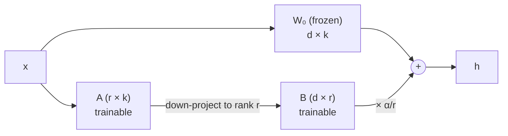
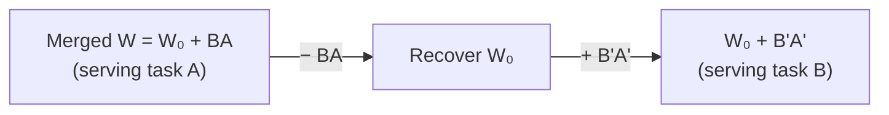

# The low-rank reparametrization

## Freeze W₀, learn a thin BA on the side

For a pre-trained weight matrix W₀ ∈ ℝ^{d×k}, LoRA constrains its update to a
**low-rank product** instead of a full matrix:

> "we constrain its update by representing the latter with a low-rank
> decomposition W₀ + ∆W = W₀ + BA, where B ∈ ℝ^{d×r}, A ∈ ℝ^{r×k}, and the rank
> r ≪ min(d, k). During training, W₀ is frozen … while A and B contain trainable
> parameters." — Section 4.1

The modified forward pass runs both paths on the **same input** and sums them:

> `h = W₀x + ∆Wx = W₀x + BAx` — Eq. 3

The shared input is the key: `BA` is a *parallel* branch, not a new layer stacked
on top — that's what later lets it disappear at inference time.

## Initialization and the α/r knob

> "We use a random Gaussian initialization for A and zero for B, so ∆W = BA is
> zero at the beginning of training." — Section 4.1

Starting at ∆W = 0 means the adapted model **begins identical** to the pre-trained
one — adaptation only adds signal. The update is then scaled by α/r, a constant
that behaves like a learning-rate knob:

> "We then scale ∆Wx by α/r … we simply set α to the first r we try and do not
> tune it. This scaling helps to reduce the need to retune hyperparameters when we
> vary r." — Section 4.1

## A strict generalization of full fine-tuning

LoRA isn't a weaker cousin of fine-tuning — it contains it:

> "as we increase the number of trainable parameters, training LoRA roughly
> converges to training the original model, while adapter-based methods converge to
> an MLP and prefix-based methods to a model that cannot take long input
> sequences." — Section 4.1

Set r to the full rank of W and you recover full fine-tuning's expressiveness. The
other families converge to something *different* from the original model.

## No added inference latency — by construction

Because `BA` is just a matrix the same shape as W₀, you can fold it in before
serving:

> "we can explicitly compute and store W = W₀ + BA and perform inference as usual.
> … this guarantees that we do not introduce any additional latency during
> inference compared to a fine-tuned model by construction." — Section 4.1

Task-switching becomes cheap arithmetic on the weights:

## Where to apply it in a Transformer

The self-attention module has four weight matrices (W_q, W_k, W_v, W_o); the MLP
has two more. The paper keeps it minimal:

> "We limit our study to only adapting the attention weights for downstream tasks
> and freeze the MLP modules … both for simplicity and parameter-efficiency." — Section 4.2

In most experiments LoRA is applied to just **W_q and W_v**. *Which* matrices and
*what* rank turn out to matter a lot — that's the subject of a later lesson.
