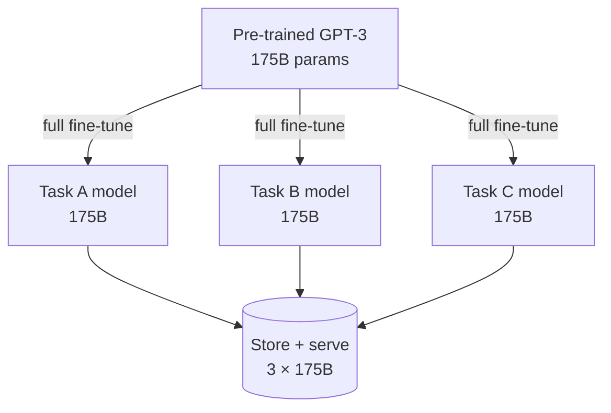

# Why full fine-tuning doesn't scale

## One base model, many tasks — and a full copy each time

The dominant NLP recipe is pre-train once on general data, then **adapt** to each
downstream task. The default way to adapt is fine-tuning, which updates every
parameter — so the adapted model is exactly as large as the original.

> "The major downside of fine-tuning is that the new model contains as many
> parameters as in the original model." — Section 1

At RoBERTa or GPT-2 scale that's an inconvenience. At GPT-3 scale it's a wall:

> "for each downstream task, we learn a different set of parameters ∆Φ whose
> dimension |∆Φ| equals |Φ₀|. … if the pre-trained model is large (such as GPT-3
> with |Φ₀| ≈ 175 Billion), storing and deploying many independent instances of
> fine-tuned models can be challenging, if at all feasible." — Section 2

Every task gets its own 175B-parameter checkpoint. Ten tasks means ten copies.

## The existing fixes each break something

Two prior families tried to adapt only a few parameters (Section 3):

| Strategy | Idea | What it costs |
|---|---|---|
| **Adapter layers** | Insert small bottleneck layers between existing layers | Extra layers run **sequentially** → added inference latency |
| **Prompt / prefix tuning** | Optimize special input tokens or prefix activations | Eats **usable sequence length**; "difficult to optimize" |

Adapters look cheap (<1% of params) but can't hide:

> "large neural networks rely on hardware parallelism to keep the latency low, and
> adapter layers have to be processed sequentially. This makes a difference in the
> online inference setting where the batch size is typically as small as one." — Section 3

And both families often **fail to match** full fine-tuning:

> "these method often fail to match the fine-tuning baselines, posing a trade-off
> between efficiency and model quality." — Section 2

## The hypothesis that unlocks LoRA

LoRA's bet comes from work on intrinsic dimension:

> "the learned over-parametrized models in fact reside on a low intrinsic
> dimension. We hypothesize that the change in weights during model adaptation also
> has a low 'intrinsic rank'." — Section 2

If the *update* ∆W is low-rank, you never have to learn a full d×d matrix per task
— you can learn a thin factorization of it. That's the whole idea, and the next
lesson builds it.
