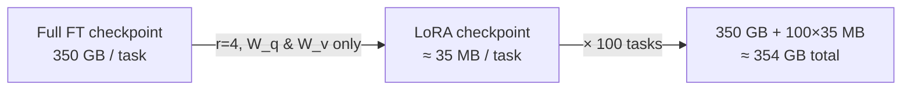

# What LoRA buys you

## On GPT-3 175B: fewer parameters, equal-or-better quality

The headline stress test scales to GPT-3 175B. LoRA trains a tiny fraction of the
parameters and still **matches or beats** full fine-tuning (Table 4):

| Method | Trainable params | WikiSQL Acc. | MNLI-m Acc. |
|---|---|---|---|
| Full fine-tune (FT) | 175,255.8M | 73.8 | 89.5 |
| PreEmbed (prompt) | 3.2M | 63.1 | 88.6 |
| Adapter_H | 40.1M | 73.2 | 91.5 |
| **LoRA** | **4.7M** | **73.4** | **91.7** |

LoRA at 4.7M trainable params edges out full fine-tuning at 175B — a ~37,000×
reduction in trainable parameters with no quality loss.

## The deployment savings are the real prize

> "we reduce the VRAM usage by up to 2/3 … On GPT-3 175B, we reduce the VRAM
> consumption during training from 1.2TB to 350GB. With r = 4 and only the query
> and value projection matrices being adapted, the checkpoint size is reduced by
> roughly 10,000× (from 350GB to 35MB)." — Section 4.2

A hundred fully fine-tuned models would be ~35TB; a hundred LoRA models share one
350GB base and cost ~354GB. The paper also reports a **25% training speedup** on
GPT-3 175B, because gradients aren't computed for the frozen majority.

## Why "no inference latency" matters: the adapter comparison

Adapters add depth that must run sequentially. In the online setting (batch size 1)
that's a measurable tax — and LoRA pays none of it, because it merges into W₀
(Table 1, GPT-2 medium forward pass, milliseconds):

| Setting (batch / seq) | Fine-Tune / LoRA | Adapter_L | Adapter_H |
|---|---|---|---|
| 32 / 512 | 1449.4 | +2.2% | +3.0% |
| 1 / 128 | 19.8 | **+20.7%** | **+30.3%** |

The penalty is worst exactly where latency matters most: short sequences, batch
size one. LoRA's row *is* the fine-tune row — merging means zero overhead by
construction.

## Counting LoRA's trainable parameters

For each adapted weight matrix, LoRA adds B (d×r) and A (r×d) — that's `2·d·r`
parameters. Across the model:

> "|Θ| = 2 × L̂_LoRA × d_model × r, where L̂_LoRA is the number of weight matrices
> we apply LoRA to." — Section 5.1

This is why the knobs compose so cleanly: on GPT-3 (d_model = 12,288, 96 layers),
adapting **W_q and W_v at r=4** and adapting **one type at r=8** both land at the
same ~18M-parameter budget used throughout Section 7. The next step makes you
compute it.
