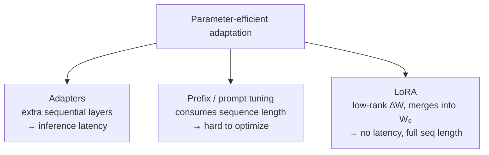

# Where LoRA fits — and where it doesn't

## Positioning against the alternatives

LoRA borrows the bottleneck idea from adapters but moves it off the critical path:

> "Our method uses a similar bottleneck structure to impose a low-rank constraint
> on the weight updates. The key functional difference is that our learned weights
> can be merged with the main weights during inference, thus not introducing any
> latency, which is not the case for the adapter layers." — Section 6

And against prompt/prefix methods, the limit is structural:

> "this line of works can only scale up by using more special tokens in the prompt,
> which take up available sequence length for task tokens." — Section 6

The paper also notes LoRA is **orthogonal** to many of these — it can be *combined*
with prefix tuning (Appendix E), not just chosen instead of it.

## The honest limitations

LoRA's no-latency guarantee comes from merging — and merging is also its main
catch:

> "it is not straightforward to batch inputs to different tasks with different A
> and B in a single forward pass, if one chooses to absorb A and B into W to
> eliminate additional inference latency." — Section 4.2

You *can* keep the weights unmerged and pick LoRA modules per sample in a batch —
but then you give back the zero-latency property. It's a real trade-off, not a free
lunch.

The conclusion is candid about what's still heuristic:

> "We mostly depend on heuristics to select the weight matrices to apply LoRA to.
> Are there more principled ways to do it?" — Section 8

And it leaves the deeper why open: how pre-training features get transformed for
downstream tasks "is far from clear" — LoRA just makes that question more tractable
than full fine-tuning does. The next step works four adoption decisions through
these limits.
