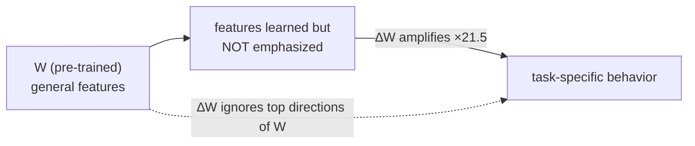

# Understanding the low-rank updates

LoRA works empirically — Section 7 asks *why*, using GPT-3 175B. Three questions:
which matrices to adapt, how low the rank can go, and how ∆W relates to W.

## Which matrices? Spread thin beats pile deep

Given a fixed 18M-parameter budget, the paper compares concentrating the budget on
one attention matrix at high rank vs. spreading it across two at lower rank
(Table 5):

| Adapted weights | Rank | WikiSQL | MultiNLI |
|---|---|---|---|
| W_q only | 8 | 70.4 | 91.0 |
| W_v only | 8 | 73.0 | 91.0 |
| W_q, W_v | 4 | **73.7** | 91.3 |
| W_q, W_k, W_v, W_o | 2 | 73.7 | **91.7** |

> "putting all the parameters in ∆W_q or ∆W_k results in significantly lower
> performance, while adapting both W_q and W_v yields the best result. This
> suggests that even a rank of four captures enough information in ∆W such that it
> is preferable to adapt more weight matrices than adapting a single type of
> weights with a larger rank." — Section 7.1

## How low can the rank go? Surprisingly: r = 1

> "To our surprise, a rank as small as one suffices for adapting both W_q and W_v
> on these datasets while training W_q alone needs a larger r." — Table 6 caption

Across r = 1, 2, 4, 8, 64, accuracy for {W_q, W_v} barely moves. The authors check
*why* by comparing the subspaces learned at r=8 and r=64 (Grassmann-distance
similarity, Eq. 4): the **top singular direction overlaps strongly**, the rest is
mostly noise.

> "Directions corresponding to the top singular vector overlap significantly
> between A_{r=8} and A_{r=64}, while others do not … providing an explanation of
> why r = 1 performs quite well." — Section 7.2

The practical takeaway: increasing r doesn't buy a more meaningful subspace, so a
very low rank is genuinely sufficient — the update *is* rank-deficient.

## How does ∆W relate to W? It amplifies the quiet directions

Projecting W onto ∆W's subspace and comparing Frobenius norms (Table 7, r=4):

| Quantity | Value |
|---|---|
| ‖U⊤W_q V⊤‖_F (W in ∆W's directions) | 0.32 |
| ‖U⊤W_q V⊤‖_F using W's *own* top directions | 21.67 |
| ‖U⊤W_q V⊤‖_F using a random matrix | 0.02 |
| Amplification factor ‖∆W_q‖_F / 0.32 | **≈ 21.5×** |

Three conclusions, in the paper's words:

> "First, ∆W has a stronger correlation with W compared to a random matrix …
> Second, instead of repeating the top singular directions of W, ∆W only amplifies
> directions that are not emphasized in W. Third, the amplification factor is
> rather huge: 21.5 ≈ 6.91/0.32 for r = 4." — Section 7.3

So adaptation isn't learning brand-new features or re-stating dominant ones — it's
**turning up features the base model already had but kept quiet**. That's the
mechanistic reason a thin, low-rank update is enough.
