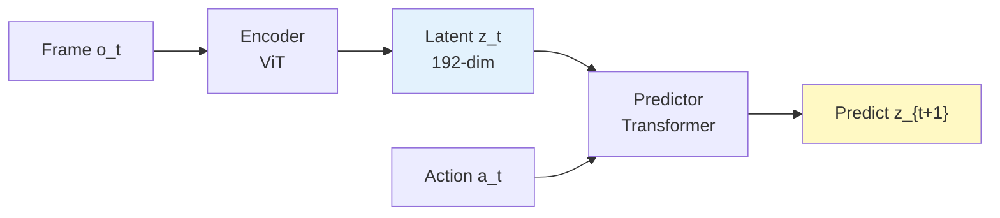
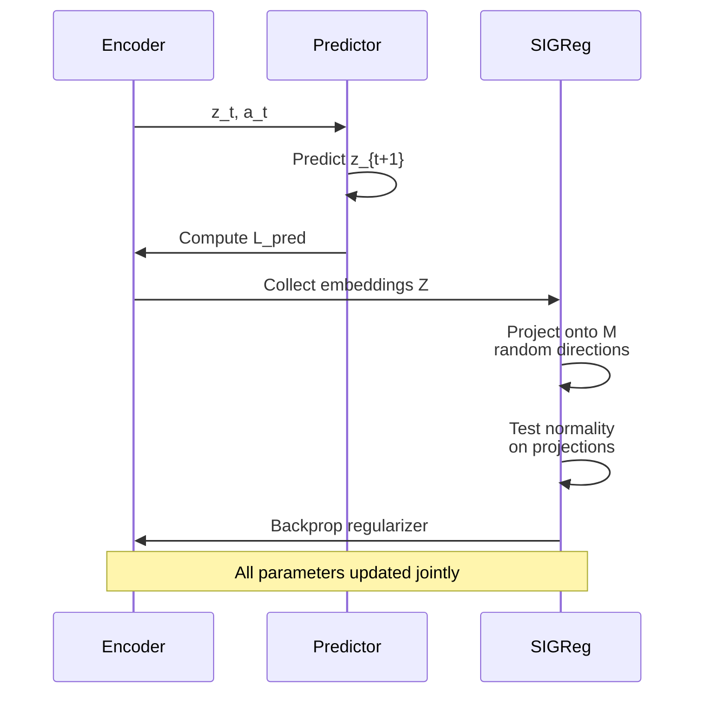

# The LeWorldModel Architecture

LeWorldModel is simple — that's the entire point. Two components learn jointly: an encoder and a predictor.

## The Architecture

**Encoder:** Takes a frame observation and compresses it into a low-dimensional embedding.
- Implementation: Vision Transformer (ViT) tiny (~5M parameters)
- Patch size 14, 12 layers, 3 attention heads
- Output: 192-dimensional embedding from the [CLS] token
- Extra step: One-layer MLP with Batch Normalization (needed to prevent the ViT's Layer Normalization from interfering with the regularizer)

**Predictor:** Models dynamics in latent space. Given the current embedding and an action, it predicts the *next* embedding.
- Implementation: Transformer (~10M parameters)
- 6 layers, 16 attention heads
- Actions injected via Adaptive Layer Normalization at each layer
- Auto-regressive: predicts one frame at a time with causal masking

Total: **15M parameters**, trainable on a single GPU in a few hours.

## The Training Objective: Two Terms, Not Seven

This is where LeWM breaks the mold. The training loss has **only two terms**:

### 1. Prediction Loss

$$L_{\text{pred}} = \|z_{t+1} - \hat{z}_{t+1}\|_2^2$$

Where $\hat{z}_{t+1}$ is the predictor's output and $z_{t+1}$ is the true next embedding (from the encoder).

**What it does:** Incentivizes the encoder to learn a predictable representation and the predictor to model dynamics accurately.

**The problem:** Alone, this loss leads to collapse. The model can trivially satisfy it by making all embeddings identical.

### 2. SIGReg: Preventing Collapse Without Heuristics

Instead of exponential moving averages or stop-gradient tricks, LeWM uses **Sketched-Isotropic-Gaussian Regularization** (SIGReg). It's elegant:

> "Make the embeddings look like they came from a Gaussian distribution."

If embeddings are spread out like random samples from a Gaussian, they can't all be identical. They *have* to be diverse.

**How SIGReg works:**

Imagine testing whether a high-dimensional point cloud is Gaussian-distributed. You can't use standard 1D normality tests directly — they don't scale. So SIGReg does this:

1. Pick a random direction in the embedding space (e.g., a unit vector in 192 dimensions)
2. Project all embeddings onto that direction (getting 1D values)
3. Run a statistical normality test (Epps–Pulley test) on those 1D values
4. Repeat with M different random directions (default: 1024)
5. Average the test statistics

By the **Cramér–Wold theorem**: if all 1D projections are Gaussian, then the full 192D distribution is Gaussian.

$$\text{SIGReg}(Z) = \frac{1}{M} \sum_{m=1}^{M} T(h^{(m)})$$

Where $T$ is the Epps–Pulley test statistic and $h^{(m)} = Z u^{(m)}$ is the projection onto direction $u^{(m)}$.

**Why this works:** The test statistic is differentiable (via quadrature integration), so gradients flow back to the encoder. The embeddings learn to match a Gaussian distribution because that's the regularizer's target.

## The Complete Objective

$$L_{\text{LeWM}} = L_{\text{pred}} + \lambda \cdot \text{SIGReg}(Z)$$

That's it. Two terms, one hyperparameter ($\lambda$), no heuristics.

## Why No Stop-Gradient? No EMA?

Most JEPA methods use exponential moving averages (EMA) or stop-gradient operations to stabilize training. These are *heuristics* — they help empirically but don't optimize any well-defined objective.

LeWM doesn't need them. SIGReg is:
- **Principled:** It directly targets the Gaussian assumption via a statistical test
- **Scalable:** Random projections are fast even in high dimensions
- **Stable:** The regularizer is smooth and differentiable everywhere

All gradients flow freely. Everything is optimized jointly. Training is simpler and more stable as a result.
