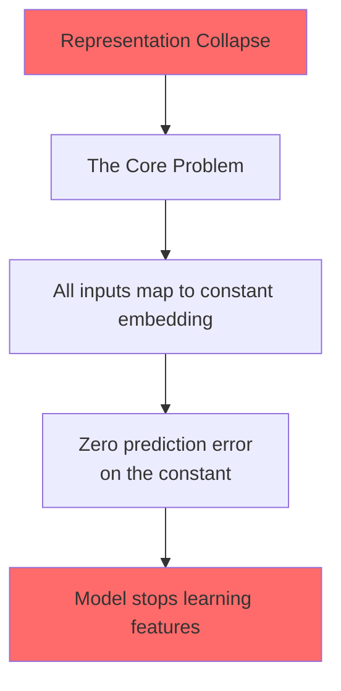

# Why Learn World Models in Latent Space?

Imagine you're teaching a robot to push a block to a target. The robot sees raw pixels — millions of values describing the scene. But the robot doesn't need to predict *every pixel* in the next frame. It only needs to predict the block's new position, the target's location, and whether the target was reached. The irrelevant stuff — the exact shade of the wall, the reflections on the block — wastes learning capacity.

**Joint Embedding Predictive Architectures** (JEPAs) solve this by learning in *compressed space*. Instead of:
1. Encode pixels → predict next pixels → decode back to pixels

They do:
1. Encode pixels → predict next *embedding* → use embedding for planning

This is wildly more efficient. The embedding captures only task-relevant dynamics.

## The Problem: Representation Collapse

But there's a catch. If you train a JEPA naively with just a prediction loss — "predict the next frame's embedding" — the model discovers a cheat: **map everything to the same constant embedding.** A constant representation trivially satisfies the prediction loss (constant → constant). The encoder stops learning meaningful features.

> **Why does this happen?** The prediction loss alone doesn't penalize identical outputs. It only penalizes prediction error. A constant embedding has *zero* prediction error on itself — it's a trivial fixed point.

This is called **representation collapse**, and it's been the core blocker for JEPA-based world models. Every existing approach — from I-JEPA to PLDM — had to add extra tricks to prevent it: exponential moving averages, frozen encoders, multi-objective losses with six or more terms.

## The Trade-Off Trap

Different methods chose different trade-offs:

- **End-to-end learners** (PLDM): Learn encoder and predictor jointly from pixels. Clean idea, but fragile. Requires 6+ hyperparameters and complex loss functions.
- **Foundation-based** (DINO-WM): Freeze a pre-trained vision encoder. Stable and simple. But you're locked into whatever the pretrained model learned — you can't adapt to your specific task.
- **Task-specific** (Dreamer, TD-MPC): Add reward signals or privileged state. Effective but not task-agnostic and requires external supervision.

**What if you could get all three strengths in one method?** That's what LeWorldModel does.

