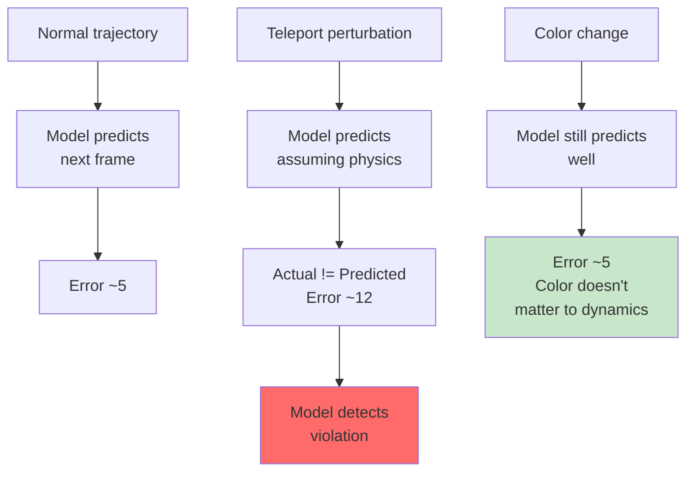

# What Physics Does LeWM Actually Learn?

A good world model doesn't just predict pixels — it should capture the *underlying physics*. LeWM learns in a compact latent space, but does that 192-dimensional embedding actually encode meaningful physical understanding?

Yes. And we can measure it.

## Probing Physical Quantities

One way to test: **train linear and nonlinear probes** on top of the learned embeddings. Ask: "Can I recover the block's position just from the latent embedding?"

Results on Push-T (pushing a block to a target):

| Physical Property | Method | Linear MSE | Correlation |
|-------------------|--------|-----------|------------|
| Agent Location | LeWM | 0.052 | 0.974 |
| | PLDM | 0.090 | 0.955 |
| Block Location | LeWM | 0.029 | 0.986 |
| | PLDM | 0.122 | 0.938 |
| Block Angle | LeWM | 0.187 | 0.902 |
| | PLDM | 0.446 | 0.745 |

**Interpretation:** The linear probes achieve high correlation (>0.90) on all quantities for LeWM, often beating PLDM. This means the latent space encodes explicit *geometric* information — positions, orientations — not just "will the next thing be different?"

This is surprising. LeWM was never trained on position labels or angle annotations. It discovered these invariants *purely* from predicting next frames. The encoder learned that preserving spatial structure helps prediction.

> **But wait — isn't that what vision models always do?** Not quite. Many learned representations capture "the next thing will be different" without preserving spatial structure. LeWM's spatial organization is *stronger* than end-to-end methods like PLDM.

## Latent Space Structure

**t-SNE visualization:** When you map the latent space to 2D for visualization, does it have structure?

Yes. The embedding space preserves **neighborhood relationships**. Frames with similar spatial configurations cluster together. The latent space is organized spatially — not random.

**Reconstruction test:** Train a decoder (added *after* training) to reconstruct the original image from a single 192-dim embedding. No reconstruction loss was used during training — the model never saw a decoder.

Result: The decoder recovers the scene structure convincingly. Objects are in the right place, spatial layout is preserved. This confirms the latent space captures visual information, not just "abstract dynamics."

## Violation-of-Expectation: Detecting Physics Violations

Here's the hardest test. Can LeWM detect when physics has been violated? If a robot teleports (physically impossible), or an object changes color (visually irrelevant to physics), does the model's prediction error spike?

**Setup:** Train rollouts normally, then introduce perturbations:
- **Agent teleport:** The agent suddenly appears in a different location
- **Agent color change:** The agent's color switches (visually obvious, physically irrelevant)
- **Block color change:** The block's color switches
- **Block teleport:** The block suddenly appears elsewhere

**Hypothesis:** The model should show *surprise* (high prediction error) when physics is violated (teleportation) but less surprise for color changes.

**Result on Push-T:**

| Perturbation | Prediction Error | Surprise |
|-------------|-----------------|----------|
| No perturbation | ~5 MSE | Baseline |
| Block color change | ~5 MSE | Low (as expected) |
| Block teleport | **~12 MSE** | High (block physics violated) |
| Agent color change | ~5 MSE | Low |
| Agent teleport | **~11 MSE** | High (agent physics violated) |

The model shows significantly higher prediction error when *physics* is violated (teleportation) than when only *appearance* changes (color). This suggests LeWM has learned some notion of **physical plausibility** — not just visual prediction.

## What This Means

LeWM's latent space is not just a compressed, predictable representation. It's *structured around physics*:

1. **Spatial invariants** are preserved (probing recovers positions and angles)
2. **Spatial layout** is maintained (t-SNE and reconstruction show structure)
3. **Physics violations** trigger surprise (teleportation errors spike, color changes don't)

The model learned these properties without any explicit supervision. It discovered that preserving physical structure *helps* prediction. This is what Yann LeCun has called **"world model priors"** — the model learns the implicit structure of how the world works, not just memorizing pixel transitions.
