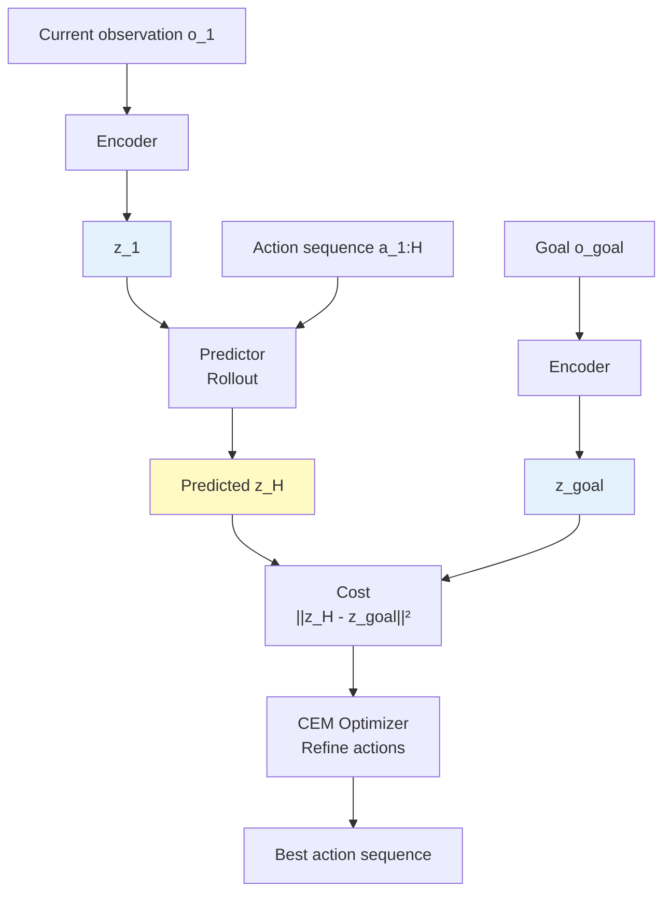
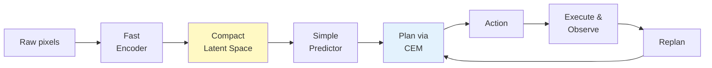

# Planning and Performance: Fast, Simple, Competitive

Once the world model is trained, how do you use it to control the robot? LeWM uses **latent Model Predictive Control** (MPC) — plan in the compressed space, not in pixels.

## How Planning Works

**Goal:** Given a current observation and a target goal, find the best sequence of actions.

**In LeWM:**

1. **Encode the goal:** Embed the target image to get $z_g = \text{enc}(o_{\text{goal}})$

2. **Roll out action sequences:** For a candidate action sequence $a_1, a_2, \ldots, a_H$:
   - Use the encoder to get $z_1 = \text{enc}(o_1)$
   - Use the predictor to forecast: $\hat{z}_{t+1} = \text{pred}(z_t, a_t)$
   - Unroll the full trajectory in latent space

3. **Define a cost:** How far is the final latent state from the goal?
   $$C(\hat{z}_H) = \|\hat{z}_H - z_g\|_2^2$$

4. **Optimize the action sequence:** Solve:
   $$a^*_{1:H} = \arg\min_{a_{1:H}} C(\hat{z}_H)$$

   Using **Cross-Entropy Method (CEM)** — a sampling-based optimizer that iteratively refines the action distribution.

5. **Replan (MPC):** Only execute the first K actions, then re-encode the new observation and plan again. This limits error accumulation from auto-regressive rollouts.

## Performance: Speed and Accuracy

How does LeWM actually perform on real control tasks?

### Speed: 48× Faster Than Foundation Models

Planning in LeWM's 192-dim latent space is dramatically faster than in DINO-WM's space (which uses a large pre-trained DINOv2 encoder):

| Method | Planning Time | Speedup |
|--------|---------------|---------|
| **LeWM** | **0.98 seconds** | **1×** |
| DINO-WM | 47 seconds | 48× slower |

DINO-WM encodes observations into ~200× more tokens, making planning much slower. LeWM's compression is ruthless but effective.

### Accuracy: Competitive or Better

On diverse tasks (manipulation, navigation, locomotion), LeWM competes with or beats end-to-end alternatives:

| Environment | LeWM | PLDM | DINO-WM | Best |
|-------------|------|------|---------|------|
| **Two-Room** | 87% | 100% | 97% | PLDM |
| **Reacher** | 86% | 78% | 79% | LeWM |
| **Push-T** | 96% | 92% | 78% | LeWM |
| **OGBench-Cube** | 74% | 65% | 86% | DINO-WM |

**Key observations:**

- LeWM wins on complex, high-dimensional tasks (Push-T, Reacher)
- PLDM and DINO-WM win on very simple tasks (Two-Room), possibly because the Gaussian assumption in SIGReg overshoots for ultra-low-complexity data
- Overall: LeWM is the most versatile

## Hyperparameter Simplicity

This is the hidden win. Compare tuning complexity:

- **PLDM:** 6+ hyperparameters (multiple loss weights), requires polynomial-time grid search O(n⁶)
- **DINO-WM:** Depends on the pre-trained encoder; task-agnostic tuning doesn't apply
- **LeWM:** Only 1 effective hyperparameter ($\lambda$), can be tuned via **bisection search O(log n)**

LeWM's training loss is smooth and well-behaved. The prediction loss decreases steadily, and SIGReg drops quickly in the first training phase, then plateaus. Compare that to PLDM's seven loss terms fighting each other with noisy, non-monotonic curves.

**Result:** Stable training, faster hyperparameter search, less manual fiddling.

