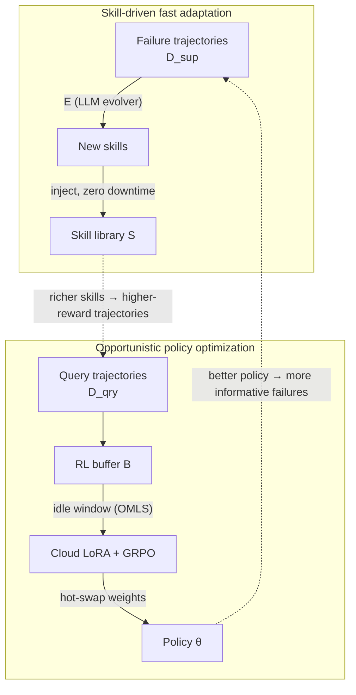

## Two loops, two clocks, one shared model

You now know the meta-model M = (θ, S) and the support/query split. MetaClaw
improves *both halves* of M, but through mechanisms that don't even look like
the same kind of computation.

### Loop 1 — Skill-driven fast adaptation (gradient-free)

```
S_{g+1} = S_g ∪ E(S_g, D_sup_g)
```

E is a **skill evolver** — an LLM that reads the failure trajectories in
D_sup_g and synthesizes new behavioral instructions. `g` is the **skill
generation**, incremented every time the library changes.

> "This mechanism is gradient-free by design, not by approximation. The
> skill library S lives in a discrete natural-language space where gradient
> descent is ill-defined." — Section 3.2

This step touches only S, leaves θ untouched, and — because it's a prompt
edit, not a weight swap — **takes effect immediately with zero service
downtime.**

### Loop 2 — Opportunistic policy optimization (gradient-based)

```
θ_{t+1} = θ_t + α ∇_θ E_{(τ,ξ,g')∼B} [ R(π_θ(· | τ, S_g')) ]
```

This is a standard policy-gradient update (GRPO under the hood, via cloud
LoRA fine-tuning) — but trained **only on query data**, using a process
reward model R. Note what it's optimizing for: not raw task performance, but
how well the agent performs *after* its current skills have already kicked
in.



### Why this loop is "virtuous," not just two features bolted together

Follow the dotted arrows above: a better θ produces trajectories that fail in
more *informative* ways (less noise, clearer signal for the skill evolver) —
and a richer S produces higher-reward query trajectories for the RL update to
learn from. Each mechanism's output quietly improves the other mechanism's
input.

> **Wait — if skill injection alone already improves accuracy, why bother
> with the slow, expensive RL loop at all?** Because skills only edit the
> *prompt* — they can tell the policy what rule to follow but can't force
> reliable, zero-defect execution of it. You'll see in the Results lesson
> that skills alone leave end-to-end task completion almost unchanged; only
> the weight-level update unlocks it.

Two design questions remain unanswered so far: **when** does the expensive
RL loop get to run without hurting the live user, and **which** trajectories
are safe to feed it. That's the next lesson.
