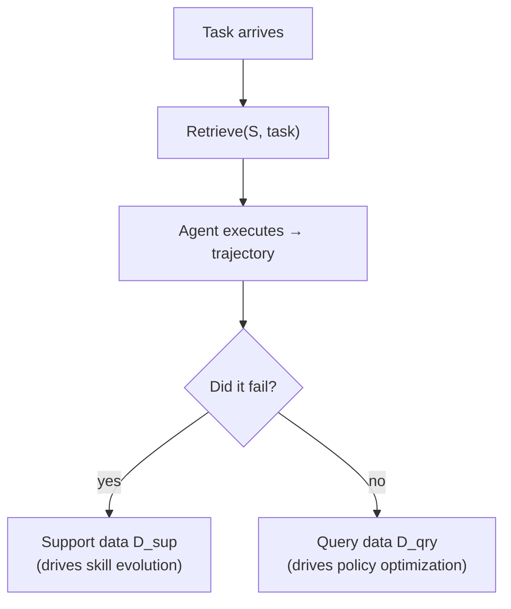

## What does the agent actually *consist of*?

If you had to checkpoint "the agent" to disk, what would you save? Just the
model weights? That misses half the picture — MetaClaw treats the skill
library as just as real a part of the agent as its parameters.

> "The agent's behavior at any point in time is fully determined by a
> **meta-model**: M = (θ, S)" — Section 2

θ is the base LLM's weights. S = {s₁, s₂, ..., sₖ} is a library of **skill
instructions** — concise, reusable behavioral directives injected into the
system prompt at inference time. Given a task τ, the agent acts according to:

```
a ∼ π_θ( · | τ, Retrieve(S, τ) )
```

`Retrieve(S, τ)` pulls only the skills relevant to *this* task via
embedding-based retrieval — the agent doesn't drag its entire accumulated
history into every prompt, just the slice that applies.

### Why every trajectory gets tagged on the way in

Here's the part that matters for everything that follows: not every
trajectory the agent produces is *useful in the same way*.



- **Support data** (D_sup): trajectories whose *failures* drive adaptation of
  the skill library. They reflect **pre-adaptation** behavior — behavior
  under the skills that just failed.
- **Query data** (D_qry): trajectories collected **after** a new skill has
  taken effect. They reflect **post-adaptation** behavior.

### The trap this prevents

> **Wait — why not just throw every trajectory into one big training
> buffer?** Because a trajectory's reward only means something *relative to
> the skill library that produced it*. A failure that triggered a new skill
> already got "fixed" by that skill — training the policy to avoid the same
> mistake again is redundant at best, and at worst it teaches the policy to
> compensate for a problem that no longer exists.

> "Maintaining a strict separation between support and query data is
> essential: mixing them would cause θ to be optimized against stale reward
> signals that no longer reflect the agent's current capabilities." — Section 2

This single sentence is the design constraint that the rest of the paper's
architecture — the versioning mechanism in particular — exists to enforce.

The framing this gives MetaClaw: it's not solving each task in isolation, but
trying to **become progressively better at adapting** to new tasks as they
arrive. That's what makes it a *continual meta-learning* system rather than
just an agent with two patches bolted on.
