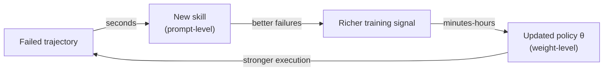

## The agent that never learns from Tuesday

Picture a CLI agent wired into 20+ messaging channels, handling whatever its
user throws at it — file edits one week, multi-agent research pipelines the
next. It fails on a task Tuesday. Wednesday, an almost-identical task arrives.
What happens?

Nothing. The weights are frozen. The agent fails the same way again.

> "Agents deployed in the wild remain largely static, trained once and served
> unchanged regardless of how user needs evolve." — Introduction

That's the **tension** MetaClaw is built to resolve: an agent must serve users
*continuously*, with zero downtime, yet its capability must keep pace with a
task distribution that keeps drifting underneath it.

### Three existing fixes, three different gaps

The paper groups prior approaches into three families — and each one solves
exactly one piece of the puzzle while ignoring the rest.

| Approach | What it does | Where it falls short |
|---|---|---|
| **Memory-based** (Reflexion, Mem0, SimpleMem) | Stores raw conversation trajectories for retrieval | Trajectories are verbose and redundant — no distillation into transferable behavior |
| **Skill-based** (Voyager, ExpeL, Agent-KB) | Compresses experience into reusable behavioral instructions | The skill library is a **static database**, never coordinated with weight optimization |
| **RL-based** (PPO, GRPO, DAPO) | Updates model weights from reward signal | Operates offline/small-scale; ignores that skills can change *underneath* a trajectory, making its reward stale |

> **Wait — isn't a bigger skill library basically the same as a better
> policy?** No. A skill is a sentence injected into the prompt; the policy is
> the weights themselves. You can have a great skill library and a policy
> that still can't execute reliably — or a good policy that keeps repeating
> mistakes nobody bothered to write down. They're solving different problems,
> which is exactly why MetaClaw runs both, not one.

### The two-timescale insight

The paper's key move is noticing these two repair mechanisms run on
*genuinely different clocks* — and that's a feature, not a problem to unify
away:

- **Seconds:** a behavioral heuristic ("always verify a file path before
  reading") can be distilled from a *single* failed conversation and injected
  immediately.
- **Minutes to hours:** improving the underlying policy across diverse task
  types needs gradient-based optimization over many trajectories.

Better policy → more *informative* failures to learn skills from. Richer
skills → higher-reward trajectories to train the policy on. That loop — not
either mechanism alone — is what MetaClaw is actually proposing.
