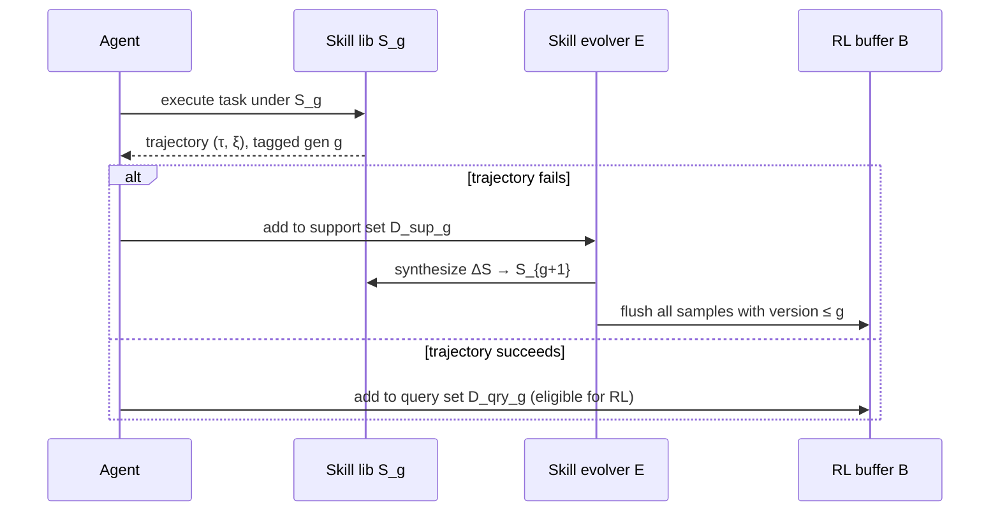
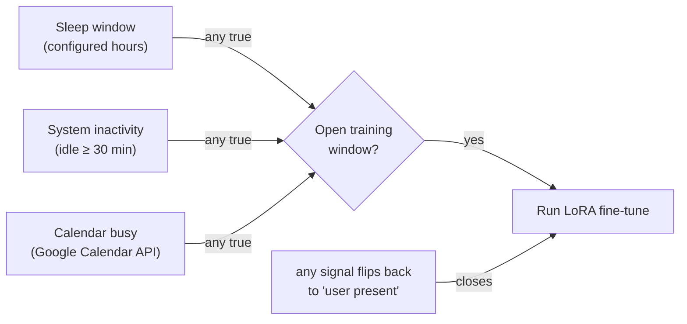

## The bug that would have wrecked the RL loop

Here's a concrete failure mode the paper walks through (Section 3.4). Say a
trajectory (τᵢ, ξᵢ) fails under skill generation Sg, and that failure is
exactly what triggers the evolver to create S_{g+1}. That trajectory carries
a reward rᵢ — but rᵢ reflects performance **before** the fix existed.

> "If this trajectory enters the RL buffer, policy optimization receives a
> gradient that penalizes θ for a failure that skill-driven adaptation has
> already corrected, optimizing for pre-adaptation rather than
> post-adaptation performance." — Section 3.4

In other words: train on it, and you'd be teaching the policy to avoid a
mistake that the *skill library* — not the policy — already fixed. Wasted
gradient signal at best, actively wrong incentive at worst.

### The fix: stamp every sample with its skill generation

Every sample is stamped with the **skill generation index** it was collected
under. The moment the generation counter advances from g to g+1, the trainer
**flushes every buffered sample with version ≤ g**. Only query data collected
*after* the new skills took effect survives into the training buffer.

This is the mechanism — not a hyperparameter, an actual data-integrity rule —
that makes it safe for skills and policy to evolve asynchronously without one
silently corrupting the other.

## When is it safe to actually train?

Policy optimization needs a weight hot-swap on completion, which briefly
interrupts inference. Run it whenever you like and you'll eventually catch a
real user mid-conversation. MetaClaw's answer is the **Opportunistic
Meta-Learning Scheduler (OMLS)** — a background daemon that watches for
*any* sign the user has stepped away.

The three signals:

1. **Sleep window** — a configured schedule (e.g. 23:00–07:00), the largest
   guaranteed-idle block.
2. **System inactivity** — OS-level idle timer (e.g. macOS `ioreg
   HIDIdleTime`); default threshold 30 minutes. On renewed input, the trainer
   **pauses gracefully via mid-batch checkpointing** rather than dropping
   work.
3. **Calendar-aware scheduling** — queries Google Calendar; a scheduled
   meeting is treated as the user being unavailable. This is the
   *anticipatory* signal — it predicts idleness from the user's own schedule
   instead of just reacting to silence.

> **Wait — three signals seems like overkill for "is the user away?"** Each
> catches a different absence pattern: sleep is long but predictable,
> inactivity catches unscheduled breaks, and calendar catches scheduled
> ones *before* they even start. A training window opens when **any** signal
> fires and closes the instant **any** signal says the user is back — and the
> trainer supports pause/resume across these fragmented windows, so it
> doesn't need one long contiguous block to make progress.
