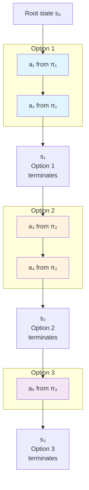

## O-MCTS: Extending MCTS with Options

Option MCTS (O-MCTS) modifies the standard MCTS algorithm in one key way: **instead of choosing actions, it chooses options.**

When an option is active, the agent follows its policy (the option selects individual actions). The search tree only *branches*—creates a new choice point—when an option *finishes* (its termination condition β is satisfied).

### Why This Matters

Standard MCTS expands the tree by one action per iteration:

```
State s → action a → State s' → action a → State s'' → ...
```

For a 40ms time budget, with a deep game, MCTS bottoms out at 10 actions ahead. That's too shallow for games requiring long-term planning.

O-MCTS expands the tree by one *option* per iteration:

```
State s → [option π₁ runs for k actions] → State s' → [option π₂ runs for m actions] → State s'' → ...
```

Each option might run for 3–10 actions internally, so O-MCTS reaches much deeper in the same time budget.

### The Tree Structure



Notice the *lower branching factor*: O-MCTS has 3 choices (which option), while standard MCTS would have many more (which action at each step).

### Algorithm Outline

O-MCTS follows the same four phases as MCTS—Selection, Expansion, Rollout, Backup—but:

- **Expansion**: choose an unexplored option (not action) at the current state
- **Rollout**: the option's policy runs until termination, then random actions
- **Backup**: like MCTS, but values are *discounted* by depth (deeper nodes get smaller credit)

The key line in the algorithm:

```
if s ∈ β(oₛ) then          // if current option has terminated
    ps ← available options  // choose next option
else
    ps ← {oₛ}             // continue with current option
```

This ensures the tree only branches when an option finishes, not at every action.

### Why It Works on Subgoal Games

On a game like Zelda (get key → unlock door → reach exit), standard MCTS might spend 40ms exploring random action sequences and never find the key-door link. O-MCTS, with a **GoToKey option**, can commit to "pursue the key" for several steps, then recognize it worked, then try **GoToDoor**. The abstraction makes the subgoal structure *visible* to the search.
