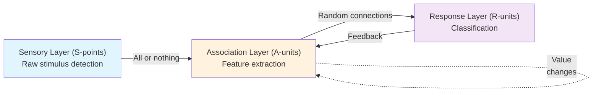

# Perceptron Architecture: Three-Layer System

## The Sensory Layer (S-points)

Stimuli impinge on a **retina of sensory units**, called S-points. Each sensory unit responds on an **all-or-nothing basis**—it either fires or doesn't, based on whether it detects the stimulus.

## The Association Layer (A-units)

Impulses from sensory units are transmitted to **association cells** (A-units) in a **projection area**. Each A-unit receives connections from multiple S-points. These connections can be either:
- **Excitatory**: boosting the A-unit's likelihood of firing
- **Inhibitory**: suppressing its firing

### The Threshold Rule

An A-unit fires when the **algebraic sum of excitatory and inhibitory impulses reaches or exceeds its threshold** θ. This is the core decision rule: `e + i ≥ θ`.

### Locality Principle

In a projection area, the origin points of each A-unit are **clustered around a central point**. The number of connections decreases exponentially with retinal distance. This spatial organization helps detect contours and local features.

## The Response Layer (R-units)

Between the association area and response cells are **random connections**—each response unit receives inputs from scattered A-units throughout the association area. Responses are mutually exclusive: when one fires, it inhibits alternatives through feedback connections.

## Learning Through Value Changes

The perceptron learns by modifying the **value** (V) of each association cell. Value represents the potency or effectiveness of the cell's output—how likely its impulses are to influence downstream targets.

## Two Phases of Response

**Predominant Phase**: Association units respond to the stimulus while response units remain inactive—a transient period of feature computation.

**Postdominant Phase**: One response becomes dominant and inhibits alternatives—the system settles on a decision.

The learning rule strengthens connections involved in the dominant response, making future similar stimuli more likely to activate the same response.
