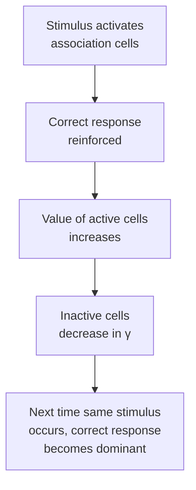

# Learning Rules: How the Perceptron Adapts

## The Value Hypothesis

The perceptron learns by adjusting the **value** (V) of each association cell. Higher value means the cell's output impulses are more potent and more likely to reach downstream targets. Value is assumed to depend on metabolic state and cell membrane condition, but is not absolutely constant.

## Three Learning Systems

The perceptron theory analyzes three fundamentally different mechanisms for updating value:

### α-System (Uncompensated Gain)

In the α-system, **an active cell gains one unit of value for every impulse** and holds that gain indefinitely.

**Key property**: The total system value grows without bound. This causes problems when the number of stimuli per response varies randomly—performance degrades significantly because large value imbalances amplify small statistical fluctuations.

**Best for**: Environments where each response is associated with a fixed, equal number of stimuli.

### β-System (Constant Feed)

In the β-system, each response's source-set is allowed a **constant rate of gain** (K). This gain is distributed among active cells in proportion to their activity.

**Key property**: The total value of the system increases linearly with time, regardless of actual learning success. The constant growth causes value imbalances that degrade performance even further than the α-system.

### γ-System (Parasitic Gain)

In the γ-system, **active cells gain value at the expense of inactive cells** in their source-set. The total value of each source-set remains constant.

**Key property**: This constraint prevents runaway value growth. The γ-system shows the best performance across different stimulus distributions because it avoids the statistical problems that plague the other two.

## Monovalent vs. Bivalent Systems

### Monovalent Reinforcement

The system receives only **positive reinforcement**: active cells gain in value when their response is correct. This is sufficient for supervised learning where the correct response is always forced.

### Bivalent Reinforcement

The system receives both **positive and negative reinforcement**—cells can gain or lose value depending on whether their response is correct or wrong. This enables **trial-and-error learning**: the system explores responses and learns which ones succeed.

Bivalent systems are more similar to natural learning, where mistakes have consequences and successes are rewarded.

## Key Insight: Constraints Enable Learning

The perceptron doesn't require any pre-programmed knowledge of what to learn. Instead, **simple local rules** (threshold activation, value modification) combined with **global constraints** (constant total value in γ-systems) enable the system to discover patterns and form associations entirely through experience.
