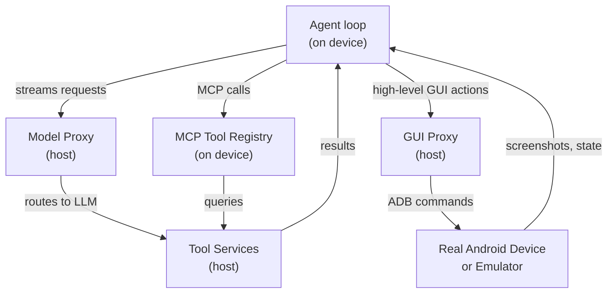

# PhoneHarness: Host-device architecture & mixed action space

## Four design goals

PhoneHarness is built around a thesis: the harness must execute realistic mixed workflows, and the benchmark must measure whether those workflows actually succeed. This shapes four requirements:

1. **Agent runs on real Android.** The phone-agent loop runs on an actual device or emulator, so tasks can create observable mobile side effects (settings changes, file writes, sent messages).
2. **Action space includes CLI, not just GUI.** Deterministic execution paths (shell commands, system calls) must be available alongside visual app control.
3. **Host tools without on-device bloat.** Heavy tools—search, email, document generation—come from host services, not crammed into the mobile environment.
4. **Every run produces an audit trail.** Execution traces capture model reasoning, tool calls, tool results, screenshots, and device state, so failures can be diagnosed after the fact.

## Architecture: Host and device

The key insight: the device side runs the agent loop itself, while the host provides three *proxy* services:

- **Model proxy:** Routes requests to a language model (Claude, Llama, etc.) with an OpenAI-compatible interface.
- **GUI proxy:** Translates high-level GUI actions (tap, swipe, fill form) into Android Debug Bridge (ADB) commands.
- **MCP proxy:** Exposes host-side tools—search, email, file ops, document generation—as a unified tool interface.

This separation keeps the agent grounded in the phone while avoiding an all-on-device dependency stack that would be brittle and heavy.

## Mixed action space

PhoneHarness exposes three affordance modes:

1. **GUI or CLI alternative:** The same task can be completed through visual app interaction OR deterministic command-line operations (shell, ADB, Python). The harness chooses the more reliable route.
2. **GUI-primary + optional CLI:** The workflow is grounded in GUI app interaction but can use CLI or host tools for auxiliary state retrieval, artifact prep, or brittle-navigation reduction.
3. **GUI-only fallback:** Visually grounded subtasks with no reliable structured route. Bounded GUI delegation is the appropriate path.

The design principle is *deterministic-first routing*: if a task can be completed via a reliable CLI command or structured tool call, the agent should prefer that path over fragile GUI interaction. "Toggle Bluetooth" is better done with a shell command than by tapping through settings. "Find a flight" is better served by a search tool than by scraping a travel app.

## What gets traced

Every benchmark run produces two layers of traces:

- **Outer trace:** The device-side agent loop—tool calls, tool results, reasoning steps, timing, final status.
- **Nested trace:** When GUI delegation occurs, a separate trace records screenshots, actions, and GUI outcomes.

This separation is critical: mixed-action failures happen at different layers. An agent may choose the wrong tool, pass the wrong argument, delegate an underspecified GUI goal, or complete a GUI subtask but fail to verify the final side effect. The trace format allows these failures to be diagnosed—not inferred from a final answer, but read directly from the execution record.
