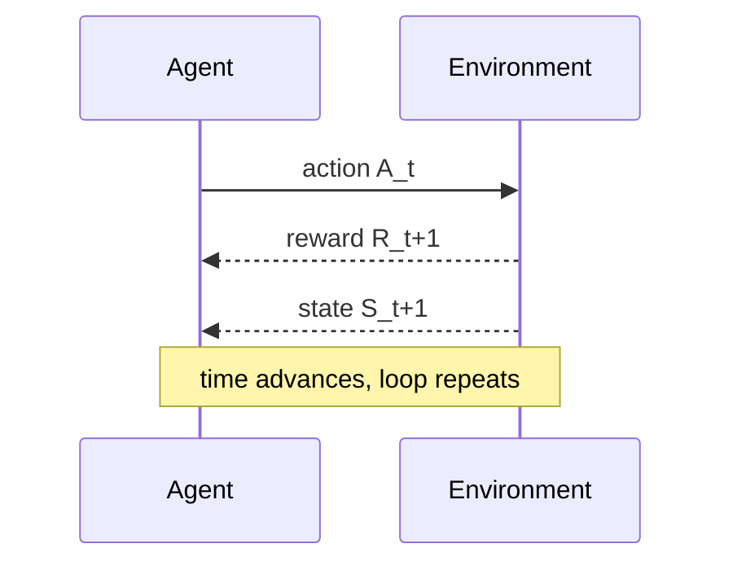
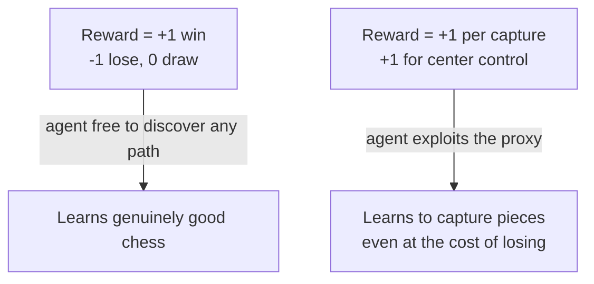

You wave your arms as an infant with no teacher, no manual — just a stream of consequences. Reach, and something happens. Cry, and something happens. Over thousands of these tiny experiments you learn what your actions are *for*. That loop — act, observe what changed, adjust — is the entire subject of this chapter, formalized down to three signals.

> "any problem of learning goal-directed behavior can be reduced to three signals passing back and forth between an agent and its environment: one signal to represent the choices made by the agent (the actions), one signal to represent the basis on which the choices are made (the states), and one signal to define the agent's goal (the rewards)." — Section 3.1

At each step `t` the agent sees a state `S_t`, picks an action `A_t` from whatever's legal in that state, and one tick later gets a reward `R_t+1` and lands in a new state `S_t+1`. The agent's rule for picking actions — a mapping from states to action probabilities — is its **policy**, written `π(a|s)`.

> **Wait — isn't the "agent" just the robot/program?** No. The boundary is drawn by what the agent can *change at will*, not by physical skin. — Section 3.1: "anything that cannot be changed arbitrarily by the agent is considered to be outside of it and thus part of its environment." A robot's own motors are environment to the agent that decides *what* to do, even though they're bolted to its body. You could know everything about how a Rubik's cube works and still be unable to solve it — knowledge of the environment isn't control over it.

## Same framework, wildly different grain sizes

| Task | State | Action | Reward |
|---|---|---|---|
| Bioreactor | sensor readings + target chemical | target temperature, stirring rate | rate of useful chemical produced |
| Pick-and-place arm | joint angles & velocities | motor voltages | +1 per object placed, small penalty for jerky motion |
| Recycling robot | battery level (high/low) | search, wait, recharge | +1 per can, −3 if battery dies |

The recycling robot is the running example for the rest of this chapter — small enough to write out completely, but with all the moving parts: a discrete state set, action sets that differ by state (`recharge` only makes sense when battery is `low`), and rewards that depend on the *transition*, not just the state.

## Why the reward signal is sacred

The agent's whole purpose collapses into one sentence — the **reward hypothesis**:

> "all of what we mean by goals and purposes can be well thought of as the maximization of the expected value of the cumulative sum of a received scalar signal" — Section 3.2

That's a strong claim: *any* goal, reduced to one number to maximize over time. The catch is what you're allowed to put in that number.

> **Wait — can't I just reward the subgoals that lead to the real goal?** This is the trap everyone falls into first. Section 3.2: "the reward signal is not the place to impart to the agent prior knowledge about *how* to achieve what we want it to do." Reward a chess agent for capturing pieces and controlling the center, and it will learn to capture pieces and control the center — sacrificing the game to do it if that's the easier path. **The reward signal is your way of communicating *what* you want, not *how* you want it achieved.** Any "helpful" shortcut reward is something the agent can now satisfy without ever achieving your actual goal.

Notice, too, that rewards are *computed in the environment*, not the agent — even rewards as personal as hunger or pain. That's deliberate: the agent's goal has to be something it can't simply decree satisfied by fiat, the way it can choose its own actions. You place the boundary at the edge of the agent's *control*, and rewards live just outside it.
