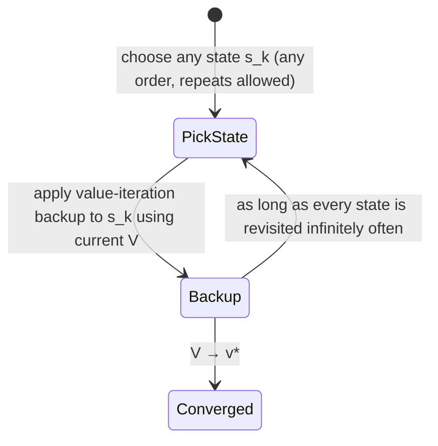

# Asynchronous DP: who said you have to sweep in order?

Every algorithm so far does a **sweep**: touch every state, once, in some fixed pass, before moving on. That's fine for the 14-state gridworld. It's a disaster for backgammon:

> "The game of backgammon has over `10^20` states. Even if we could perform the value iteration backup on a million states per second, it would take over a thousand years to complete a single sweep." — Section 4.5

**Asynchronous DP** drops the requirement that a sweep visit every state before any state gets updated twice. Back up states *in any order, any number of times each* — using whatever values happen to be sitting in memory, even if other states haven't been touched yet this round.

The convergence guarantee survives this relaxation with one condition: every state has to keep getting backed up — you can't just stop visiting some state forever. Given that, the asymptotic guarantee holds. — Section 4.5

This isn't just a parallelism trick. It means you can **interleave planning with acting**: run the backup loop on whatever states an agent's real trajectory happens to touch, letting the agent's actual experience steer which parts of a huge state space get DP attention. Chapter 8 builds directly on this idea.
