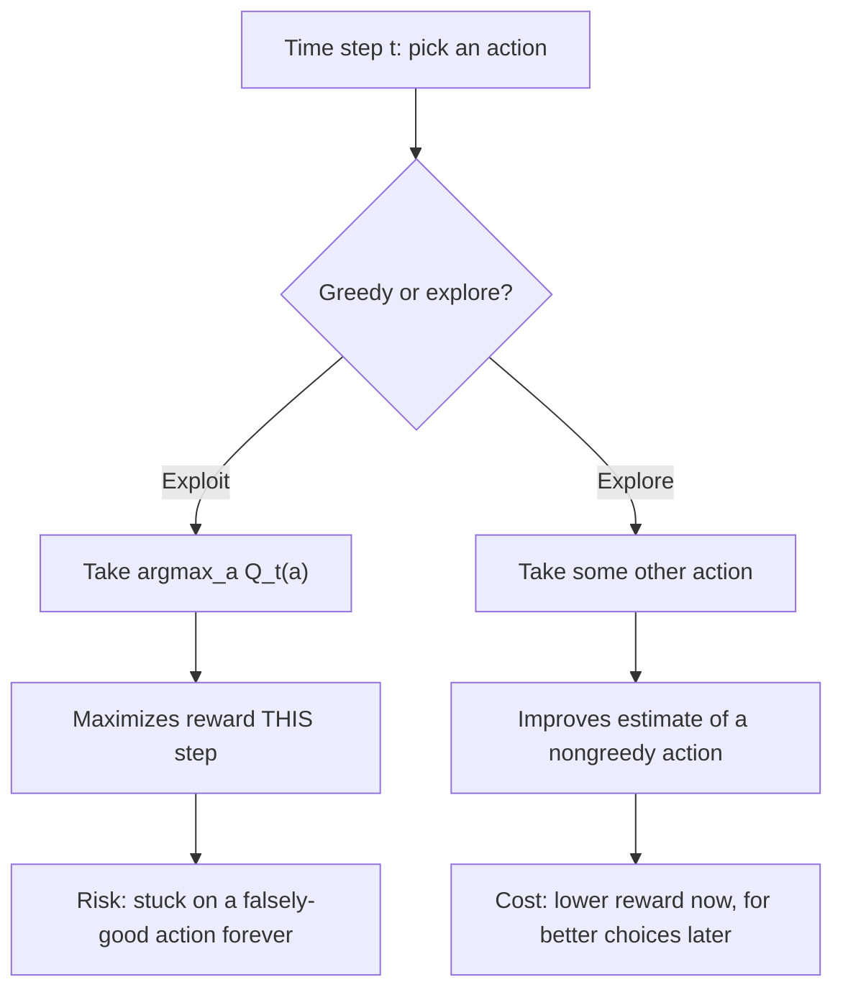

# The slot machine with a brain

## You walk into a casino with 10 levers

Not one slot machine — ten, lined up in a row. Each one pays out from its own hidden, fixed probability distribution. Pull lever 3, you get some random reward; pull it again, a different random reward, but *on average* lever 3 always pays the same amount. You don't know which lever pays best. You have 1,000 pulls. What do you do?

This is the **n-armed bandit problem**, so named because a slot machine used to be called a "one-armed bandit" — now imagine one with *n* arms.

> "Your objective is to maximize the expected total reward over some time period." — Section 2.1

Two analogies the book gives, both worth keeping in your head:
- **Slot machine**: each lever's average payout is its *value*. Pick the best lever, over and over.
- **Clinical trial**: a doctor choosing between experimental treatments for sick patients. Each treatment selection is an action; survival/well-being is the reward. (Real bandit algorithms run real trials.)

## The single most important idea in this whole book

Every action has a true mean reward — call it **q(a)**. If you knew q(a) for every action, the problem would be trivial: always pick the biggest one. You don't. You only have *estimates*, **Qₜ(a)**, built from what you've observed so far.

That gap — between the value you'd act on if you actually knew it, and the value you're forced to estimate from limited data — is where reinforcement learning lives. Everything in this chapter is a different strategy for closing that gap as fast as possible.

## Greedy vs. exploring: you can't do both on the same pull

At any moment, some action has the highest *current* estimate. Picking it is called being **greedy** — you're **exploiting** what you currently believe. Picking anything else is **exploring** — spending a pull not to win now, but to find out if you're wrong about something.

> **Wait — isn't exploring just wasting a pull?** In the short run, yes — exploring trades away expected reward *this step*. But if your estimates are noisy and you have many pulls left, the lever you *think* is best might not be. Exploring buys information that lets you exploit a better lever for the rest of the game. Pure greedy looks good on pull #1 and bad on pull #1,000.

## Watch greedy fail, concretely

The book runs greedy and two ε-greedy variants (ε = 0.01, ε = 0.1) on a "10-armed testbed" — 2,000 randomly generated 10-armed bandits, true values drawn from a normal(0,1) distribution, noisy rewards on top.

> "The greedy method performs significantly worse in the long run because it often gets stuck performing suboptimal actions. [It] found the optimal action in only approximately one-third of the tasks. In the other two-thirds, its initial samples of the optimal action were disappointing, and it never returned to it." — Section 2.2

Read that twice: greedy isn't slightly worse, it's *permanently* worse in two-thirds of cases — because one unlucky early sample convinces it that the best lever is bad, and it never tries again to find out otherwise.

| Method | Early performance | Long-run performance | Why |
|---|---|---|---|
| Greedy (ε=0) | Fastest start | Plateaus low (~1.0 vs. best ~1.55) | Never recovers from an unlucky early estimate |
| ε-greedy, ε=0.1 | Explores a lot, finds optimal action fast | Caps near 91% optimal-action rate | Keeps exploring forever — even once it knows the answer |
| ε-greedy, ε=0.01 | Slow to improve | Eventually beats ε=0.1 on both measures | Less "wasted" exploration once estimates converge |

The deeper point: **whether ε-greedy beats greedy depends on the task**. Noisier rewards → exploration matters more. Zero variance and a stationary task → greedy might actually win, because one sample reveals the truth and there's nothing left to explore for. But the moment the task is **nonstationary** — true action values drift over time — some exploration is *always* needed, "even in the deterministic case... to make sure one of the nongreedy actions has not changed to become better than the greedy one" (Section 2.2). Effective nonstationarity, the book notes, is the norm in reinforcement learning.
